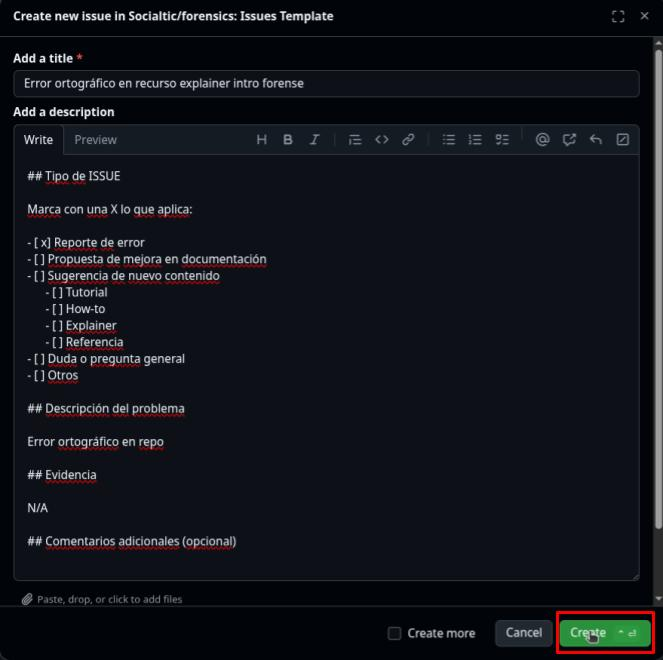
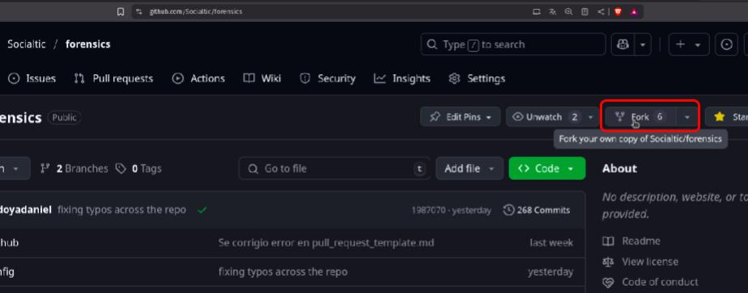
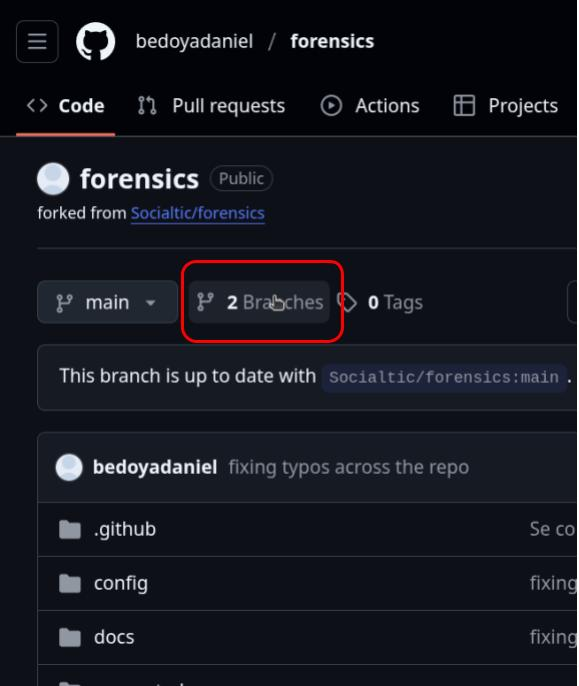
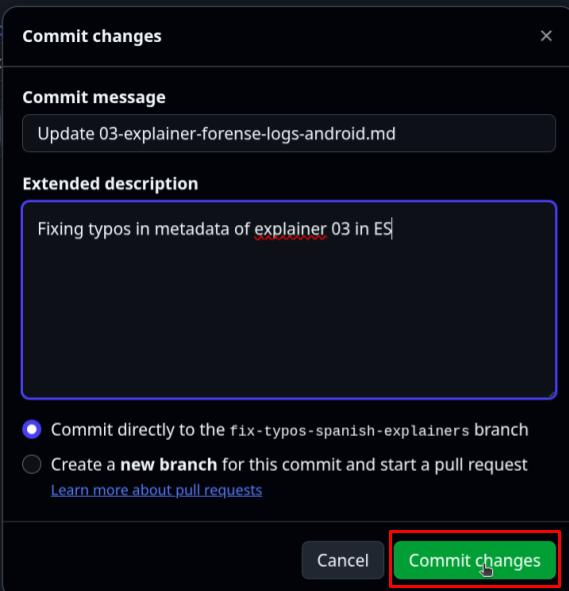
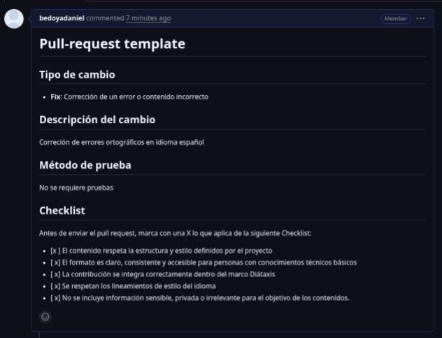
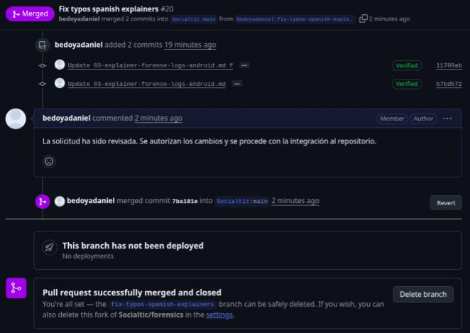

# How to collaborate with this repository?

This repository is currently hosted on GitHub, and therefore there are **two main ways** to make **direct contributions** to this repository: 

* [***Issues***](https://github.com/Socialtic/forensics/issues): Issues are **reports or requests** related to the content of the repository. Examples of issues include **spelling errors, broken links, improvements in wording**, among others. You do not need to be familiar with GitHub, Markdown, or the content structure to report an issue. Reported issues will receive a response from the repository owners. 

* [***Pull request***](https://github.com/Socialtic/forensics/pulls): Pull requests are **integration requests** where changes to the repository are proposed, **often to improve, correct, or expand its content**. Pull requests are **reviewed** by the project team and, if deemed appropriate, will be **approved and included in the public version of the repository.**

 

## Reporting issues

If you find any errors or have suggestions for improvements, **you can open an issue in the repository by [following this link](https://github.com/Socialtic/forensics/issues/new)**. Through the issue, it’s possible to suggest, discuss, and implement changes and improvements to the content. It doesn’t matter if the error is minor, such as a spelling mistake—we **love receiving improvement reports**.

When opening an issue, please **use the format described in the [issue template document](https://github.com/Socialtic/forensics/issues/new)**, which will load automatically when you try to open a new issue in the repository as shown on figure 1.

{ loading=lazy }
/// caption
**figure 1.** Issue tab in forensics repository, to start a new issue click on the green button that says “*New Issue*” on the top right hand side of the web interface of GitHub.
///

When you click, you will have the option to use the pre-loaded template or start from a blank issue. We **advise you to use the template, and remove whatever is not relevant**, as shown on **figure 2**. 

/// caption
**figure 2.** Issue tab in forensics repository, to start a new issue click on the green button that says “*New Issue*” on the top right hand side of the web interface of GitHub.
///

When using the issue template, a new window will open where you will be able to **edit the issue and complete accordingly**. If there are fields or sections that are not relevant, you can remove them. Try to be as complete and clear as possible. You can see an example on **figure 3.** 

 
/// caption
**figure 3.**  Example of new issue form using the preloaded template in the repository forensics.
///

## Integrating new content through *pull requests*

You can suggest changes and improvements to the repository directly through a pull request **following these steps**: 

**Setep 1.**: Using your own GitHub account (or an organizational one if preferred), make a [**fork**](https://docs.github.com/en/pull-requests/collaborating-with-pull-requests/working-with-forks/fork-a-repo) of the repository.   

!!! tip "Recomendation"
    You can **fork** the repository from the web interface [directly on the repository GitHub site](https://github.com/Socialtic/forensics), clicking on the “fork” button on the top of the interface as shown on **figure 4**. 

/// caption
**figure 4.** Web interface of the forensics repository, highlighting the fork tab.
///

**Step 2.** Once you generate a fork, you will have a **copy of the repository in your own account**. From this fork, it is possible to **create new branches** where you can directly change and adjust as deemed necessary.   

!!! tip "Recomendation"
    * Please use **descriptive names** for your branches, for example “fix-guide-acquisition”, “add-tutorial-analyzing-mvt-bugreport  
    * You can create branches directly from the GitHub web interface clicking on the “branches” tab as shown on **figure 5.**   

  
/// caption
**figure 5.** Web interface of the forked GitHub repository, highlighting the branches tab
///

From the branches tab it is possible to **create a new branch inside your fork of the repository**, as shown in **figure 6.**

  
/// caption
**figure 6** Web interface of the forked GitHub repository, highlighting the new branch button.
///

**Step 3.** Implement your changes, making **clear commits**, detailing what exactly you're modifying. **Figure 7** shows an example of a commit on the web interface.    

!!! tip "Recomendation"
    * You can check the [**official GitHub recommendations for commits**](https://github.com/git-guides/git-commit).   
    * When you make changes using the web interface, you will receive a confirmation message asking in what branch you want to record your changes. Select the new branch you created. 

/// caption
**figure 7.** Web interface of a commit message on GitHub for the repository forensics.
///

**Step 4.** Once you have made the changes, you can **open a pull request to ask the maintainers to implement these changes for the main repository**.   

!!! tip "Recomendation"
    * Please follow the pull request template, remove or use N/A when a section is not applicable.   
    * You can submit a pull request through the GitHub web interface. Usually when you record a change in a branch on a forked repository, you will see a pop-up option to create a new pull request as shown in **figure 8**.

/// caption
**figure 8.** Web interface of a forked repository after a commit, where an option to create a new pull request appears.
///

When you click on this option, you will have the opportunity to **edit and submit your pull request** as shown in **figure 9.** 

/// caption
**imagen 9.** Web interface of a pull request on GitHub, the template is pre-loaded when creating a new pull request. 
///

Once changes are revised and accepted, you will see the result as shown in **figure 10**. This means that changes have been applied and they should be visible when visiting forensics.socialtic.org.  

/// caption
**figure 10.** Web interface of a pull request on GitHub, showing the approval and implementation of a request.
///

## Additional resources

We also welcome **additional resources** that can help strengthen forensic practice within civil society, **even if they do not follow the [Diátaxis](https://diataxis.fr/) framework**. Depending on the content, these contributions can be shared in their **original form** within the community resources section or **collaboratively adapted** to fit the framework.

For this type of collaboration, you can contact us at: **[seguridad@socialtic.org](mailto:seguridad@socialtic.org)**
