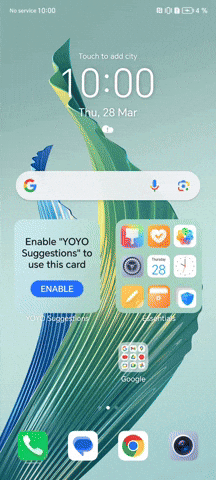
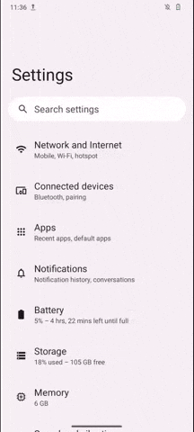
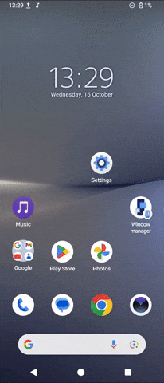
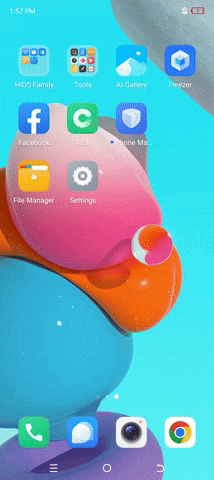
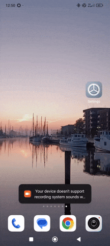

# Guía: ¿Cómo habilitar las opciones de desarrollador en diferentes dispositivos Android?

Este documento forma **parte de un repositorio de documentación técnica** que tiene como objetivo establecer una base de conocimientos probados, flexibles y accesibles para **impulsar el análisis forense consentido en beneficio de la sociedad civil**. Para organizar los contenidos, se utiliza el [marco de referencia de documentación técnica Diataxis](https://diataxis.fr/).

Este recurso en particular se enmarca dentro de la categoría de **guías how-to**, y muestra los pasos a seguir para **habilitar el menú de opciones de desarrollador en diferentes dispositivos Android**, así como una breve explicación de **qué son** las opciones de desarrollador y **porqué son útiles** al hacer forense digital. Este es un **material introductorio**, complementario a otros recursos, como el [explainer de forense basada en log para dispositivos Android](../explainers/03-explainer-forense-logs-android/03-explainer-forense-logs-android.html), y **forma parte de los pasos a seguir para realizar un triaje inicial**.   

Agradecemos la **colaboración** del [laboratorio de seguridad de Reporteros Sin Fronteras](https://rsf.org/en/digital-security-lab), quienes brindaron los insumos iniciales necesarios para la producción de esta guía. 

## ¿Qué son y porqué son útiles?

Las [**opciones de desarrollador**](https://developer.android.com/studio/debug/dev-options) hacen referencia a un **menú oculto** del sistema operativo **Android** que permite configurar algunas **funciones adicionales**, pensadas especialmente para apoyar el proceso de [depuración](https://es.wikipedia.org/wiki/Depuraci%C3%B3n_de_programas) durante la **creación de nuevas aplicaciones o cambios en el sistema**. Entre las opciones de desarrollador, también se suelen colocar algunas **configuraciones avanzadas** como por ejemplo, ajustar las preferencias del controlador gráfico o configuraciones avanzadas de redes e incluso **opciones experimentales** que aún están en prueba o desarrollo. 

Desde el punto de vista de **forense digital**, y en particular al hacer [investigaciones basadas en logs](../explainers/03-explainer-forense-logs-android/03-explainer-forense-logs-android.html) utilizando herramientas como MVT y AndroidQF, las opciones de desarrollador nos **permiten habilitar funciones claves**, como el **[depurado USB](https://es.wikipedia.org/wiki/Depuraci%C3%B3n_de_programas)**, la consola de **ADB** o la **generación** de reportes de errores o ***bug report***. Es por esto que en muchas ocasiones, el **primer paso** será habilitar el menú de opciones de desarrollador. 

## ¿Por qué hay diferentes formas de habilitarlas?

El sistema operativo Android basa su núcleo en el proyecto de código abierto [*Android Open Source Project*](https://source.android.com/)*.* Sin embargo, la [mayoría de fabricantes utilizan una versión propietaria de Google](https://www.makeuseof.com/tag/android-really-open-source-matter/), sobre la cuál se agregan capas de personalización adicionales, que en la mayoría de casos son también propietarias. Existen algunas alternativas, como por ejemplo [LineageOS](https://lineageos.org/), [Graphene OS](https://grapheneos.org/) o [CalyxOS](https://calyxos.org/), que se basan enteramente en principios de **código abierto** y buscan alejarse de los ecosistemas propietarios. 

El resultado de estos desarrollos adicionales sobre el proyecto base significa que existen una **amplia variedad de interfaces gráficas** para el sistema operativo. Podemos mencionar algunos ejemplos como: 

* [Pixel UI](https://en.wikipedia.org/wiki/Google_Pixel): Interfaz de usuario desarrollado por **Google** para los dispositivos Pixel. Es similar a la versión base de Android, pero incluye [personalizaciones adicionales y propietarias desarrolladas por Google](https://www.howtogeek.com/google-pixel-devices-stock-android/).   
* [One UI](https://es.wikipedia.org/wiki/One_UI): Interfaz de usuario desarrollada por **Samsung** para dispositivos inteligentes, incluyendo dispositivos móviles con Android desde el año 2017\. Existen versiones de One UI para teléfonos, tablets, relojes inteligentes y computadoras.  
* [HyperOS](https://es.wikipedia.org/wiki/Xiaomi_HyperOS): Interfaz de usuario desarrollada por **Xiaomi**, lanzada en 2023, y que reemplaza a la interfaz de usuario anterior conocida como [MIUI](https://es.wikipedia.org/wiki/MIUI).   
* [ColorOS](https://es.wikipedia.org/wiki/ColorOS): ColorOS es un sistema operativo móvil  e interfaz de usuario creado por **Oppo Electronics**  
* [Realme UI](https://en.wikipedia.org/wiki/Realme): Interfaz de usuario desarrollada por **Realme**, que a su vez es subsidiaria de [Oppo Electronics](https://en.wikipedia.org/wiki/Oppo), dueña también de la marca **OnePlus**.   
* [Oxygen OS](https://en.wikipedia.org/wiki/OxygenOS): Es un sistema operativo desarrollado por la empresa **OnePlus** de forma exclusiva para teléfonos móviles.    
* [Harmony OS](https://en.wikipedia.org/wiki/HarmonyOS): 	Sistema operativo desarrollado por **Huawei**. A pesar de que en ocasiones se posiciona como un sistema operativo diferente, si tienes sus bases en Android y en la capa de personalización previa, conocida como [EMUI](https://en.wikipedia.org/wiki/EMUI).  
* [Hello UI](https://beebom.com/motorola-hello-ui-review/): Interfaz desarrollada por **Motorola,** empresa parte de **Lenovo**. [Este video](https://www.google.com/url?q=https://www.youtube.com/watch?v%3Di3ZU9-TGJlE&sa=D&source=docs&ust=1753486266796661&usg=AOvVaw14C09MkoaBDTU4pbef9Aqq) muestra aspectos relevantes de la interfaz.    
* [Xperia UI](https://en.wikipedia.org/wiki/Sony_Xperia): Interfaz de usuario desarrollada por **Sony** para dispositivos [Xperia](https://en.wikipedia.org/wiki/Sony_Xperia).   
* [Magic OS](https://en.wikipedia.org/wiki/Honor_\(brand\)#MagicOS): Sistema operativo desarrollado por el fabricante [**Honor**](https://en.wikipedia.org/wiki/Honor_\(brand\)), previamente una subsidiaria de **Huawei**. 

## Lista de instrucciones paso a paso 

A continuación se muestran los **pasos a seguir** para habilitar el menú de opciones de desarrollador en **diferentes dispositivos**, así como una captura de pantalla de los menús a seguir para poder visualizar este menú. 

### Google (Pixel OS) 

Para habilitar las opciones de desarrollador en dispositivos del fabricante **Google** utilizando **Pixel OS** puedes seguir los siguientes pasos, ejemplificados también en la **imagen 1\.** 

1. Abre el menú de **Ajustes** ⚙️  
2. Navega hasta la última opción **Acerca del teléfono** 📱  
3. Ubica la información sobre el **Número de compilación** 🔢   
4. Presiona **7 veces** sobre el número de compilación, hasta que veas un mensaje de confirmación. 👆

{ loading=lazy }
/// caption
**Imagen 1**. Pasos para habilitar las opciones de desarrollador en un dispositivo Google Pixel con Android 13.
///

Las opciones de desarrollador aparecerán como un nuevo submenú dentro del apartado de **Sistema,** y se **mantendrán habilitadas** hasta que se deshabiliten (desde el menú de opciones de desarrollador).   

### Honor (Magic OS) 

Para habilitar las opciones de desarrollador en dispositivos del fabricante **Honor** utilizando la versión de Android **Magic OS** puedes seguir los siguientes pasos, ejemplificados también en la **imagen 2\.** 

1. Abre el menú de **Ajustes** ⚙️  
2. Navega hasta la última opción **Acerca del teléfono** 📱  
3. Ubica la información sobre el **Número de compilación** 🔢   
4. Presiona **7 veces** sobre el número de compilación, hasta que veas un mensaje de confirmación. 👆

Las opciones de desarrollador aparecerán como un nuevo submenú dentro del apartado de **Sistema,** y se **mantendrán habilitadas** hasta que se deshabiliten (desde el menú de opciones de desarrollador).   

{ loading=lazy }
/// caption
**Imagen 2**. Pasos para habilitar las opciones de desarrollador en un dispositivo Honor Magic Lite con la versión Magic OS 7.1 en Android 13\.
///

### Motorola (Hello UI)

Para habilitar las opciones de desarrollador en dispositivos **Motorola** utilizando la versión 13 de Android puedes seguir los siguientes pasos, ejemplificados también en la **imagen 3\.** 

1. Abre el menú de **Ajustes** ⚙️  
2. Navega hasta la última opción **Acerca del teléfono** 📱  
3. Ubica la información sobre el **Número de compilación* 🔢   
4. Presiona **7 veces** sobre el número de compilación, hasta que veas un mensaje de confirmación. 👆

{ loading=lazy }
/// caption
**Imagen 3**. Pasos para habilitar las opciones de desarrollador en un dispositivo Motorola Edge Neo 40 utilizando Hi OS en Android 13\.
///

### Nokia  

Para habilitar las opciones de desarrollador en dispositivos **Nokia** utilizando la versión de Android 13 o superior puedes seguir los siguientes pasos, ejemplificados también en la **imagen 4\.** 

1. Abre el menú de **Ajustes** ⚙️  
2. Navega hasta la última opción **Acerca del teléfono** 📱  
3. Ubica la información sobre el **Número de compilación** 🔢   
4. Presiona **7 veces** sobre el número de compilación, hasta que veas un mensaje de confirmación. 👆

Las opciones de desarrollador aparecerán como un nuevo submenú dentro del apartado de **Sistema,** y se **mantendrán habilitadas** hasta que se deshabiliten (desde el menú de opciones de desarrollador). 

{ loading=lazy }
/// caption
**Imagen 4**. Pasos para habilitar las opciones de desarrollador en un dispositivo Nokia G42 5G utilizando Android 13\.
///

### Oppo Reno 10 (Color OS)

Para habilitar las opciones de desarrollador en dispositivos **OPPO** utilizando la versión de Android 13 o superior puedes seguir los siguientes pasos, ejemplificados también en la **imagen 5\.**

1. Abre el menú de **Ajustes** ⚙️
2. Navega hasta la última opción **Acerca del teléfono** 📱
3. Ubica la información sobre el **No. de versión** 🔢
4. Presiona **7 veces** sobre el número de versión, hasta que veas un mensaje de confirmación. 👆

Las opciones de desarrollador aparecerán como un nuevo submenú dentro del apartado de **Sistema,** y se **mantendrán habilitadas** hasta que se deshabiliten (desde el menú de opciones de desarrollador). 

{: style="height:480x;width:216px"}
/// caption
**Imagen 5**. Pasos para habilitar las opciones de desarrollador en un dispositivo Oppo.
///

### Realme (Realme UI)

Para habilitar las opciones de desarrollador en dispositivos **Realme** utilizando la capa de personalización Realme UI puedes seguir los siguientes pasos, ejemplificados también en la **imagen 6\.** 

1. Abre el menú de **Ajustes** ⚙️  
2. Navega hasta la última opción **Acerca del dispositivo** 📱  
3. Ingresa al menú de **versión** 📝  
4. Ubica la información sobre el **Número de compilación** 🔢   
5. Presiona **7 veces** sobre el número de compilación, hasta que veas un mensaje de confirmación. 👆

{ loading=lazy }
/// caption
**Imagen 6**. Pasos para habilitar las opciones de desarrollador en un dispositivo Realme GT2 Pro con RealMe UI 4.0 utilizando Android 13
///

### Samsung (One UI)

Para habilitar las opciones de desarrollador en dispositivos **Samsung** utilizando la capa de personalización One UI puedes seguir los siguientes pasos, ejemplificados también en la **imagen 7\.** 

1. Abre el menú de **Ajustes ⚙️**  
2. Navega hasta la última opción **Acerca del teléfono** 📱  
3. Ingresa al menú de **Información de Software** 📝  
4. Ubica la información sobre el **Número de compilación** 🔢   
5. Presiona **7 veces** sobre el número de compilación, hasta que veas un mensaje de confirmación. 👆

{ loading=lazy }
/// caption
**Imagen 7**. Pasos para habilitar las opciones de desarrollador en un dispositivo Samsung Galaxy A54 con One UI en un dispositivo utilizando Android 13
///

### Sony (Xperia UI)

Para habilitar las opciones de desarrollador en dispositivos **Xperia** utilizando la capa de personalización Xperia UI puedes seguir los siguientes pasos, ejemplificados también en la **imagen 8\.** 

1. Abre el menú de **Ajustes** ⚙️  
2. Navega hasta la última opción **Acerca del teléfono** 📱  
3. Ubica la información sobre el **Número de compilación** 🔢   
4. Presiona **7 veces** sobre el número de compilación, hasta que veas un mensaje de confirmación. 👆

{ loading=lazy }
/// caption
**Imagen 8**. Pasos para habilitar las opciones de desarrollador en un dispositivo Sony Xperia 10V con Xperia UI 4.0 utilizando Android 14\.
///

### Tecno (Hi OS)

Para habilitar las opciones de desarrollador en dispositivos **Tecno Spark** utilizando la capa de personalización Hi OS puedes seguir los siguientes pasos, ejemplificados también en la **imagen 9\.** 

1. Abre el menú de **Ajustes** ⚙️  
2. Navega hasta la opción **Mi Teléfono** 📱  
3. Ubica la información sobre el **Número de compilación** 🔢   
4. Presiona **7 veces** sobre el número de compilación, hasta que veas un mensaje de confirmación. 👆

{ loading=lazy }
/// caption
**Imagen 9**. Pasos para habilitar las opciones de desarrollador en un dispositivo Tecno Spark Go con Hi OS utilizando Android 13\.
///

### Xiaomi (Hyper OS)

Para habilitar las opciones de desarrollador en dispositivos **Xiaomi** utilizando la capa de personalización Hyper OS puedes seguir los siguientes pasos, ejemplificados también en la **imagen 10.** 

1. Abre el menú de **Ajustes** ⚙️  
2. Ingresa a la opción de **Acerca del teléfono** 📱  
3. Ubica la información sobre el **Versión de Sistema Operativo** 🔢   
4. Presiona **7 veces** sobre el número de compilación, hasta que veas un mensaje de confirmación. 👆

{ loading=lazy }
/// caption
**imagen 10**. Pasos para habilitar las opciones de desarrollador en un dispositivo Xiamoi\.
///

Las opciones de desarrollador aparecerán como un nuevo submenú dentro del apartado de **Opciones avanzadas,** y se **mantendrán habilitadas** hasta que se deshabiliten (desde el menú de opciones de desarrollador). 

## Conclusión

La interfaz gráfica de los dispositivos Android varía entre fabricantes que utilizan como base el [proyecto de código abierto Android (AOSP)](https://source.android.com/?hl=es-419). Cada fabricante realiza sus propios desarrollos sobre esta capa base, con diferentes niveles de customización, lo que resulta en interfaces con **diferentes apariencias, menús y opciones**. 

El menú de **opciones de desarrollador** es un menú oculto, que se habilita a través de un procedimiento sencillo en la interfaz gráfica, y que es necesario para modificar **opciones claves requeridas durante un proceso de extracción forense**, como la consola ADB o un reporte de errores. En este recurso se recopilan **capturas de pantalla correspondientes a diferentes fabricantes** e interfaces, con la intención de **facilitar la habilitación las opciones de desarrollador** para personas analistas de la sociedad civil. 

Si **tienes acceso a una interfaz gráfica que no se muestra en la lista**, y deseas incorporar la captura correspondiente a este recurso, puedes escribirnos a través de un *issue* o, si te sientes cómodo con markdown, puedes enviar una solicitud de integración a través de un *pull request.*