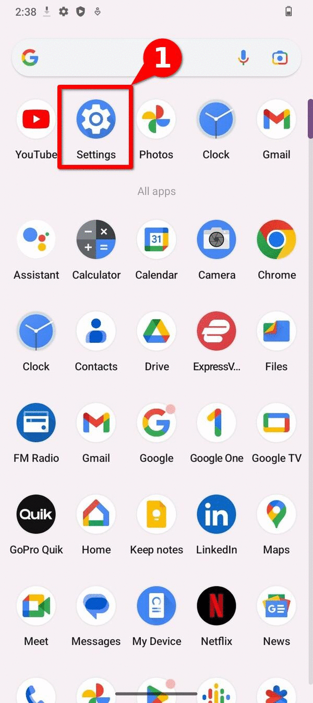
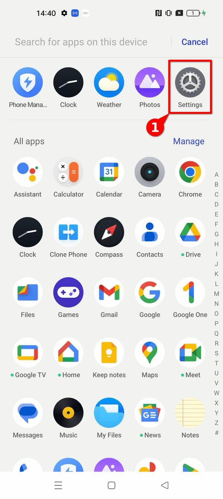
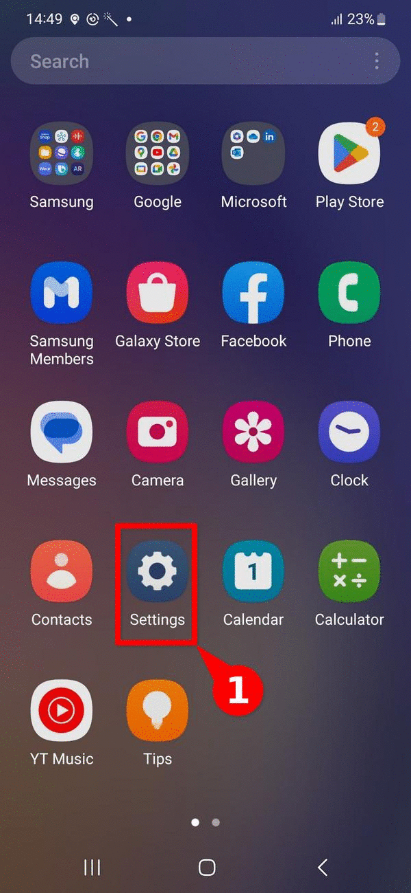
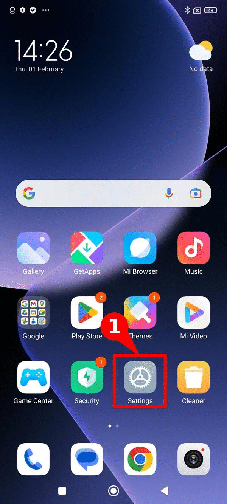

# Guía: ¿Cómo habilitar ADB en diferentes dispositivos Android?

Este recurso se enmarca dentro de la categoría de **guías how-to**, y muestra los pasos a seguir para **habilitar la depuración por USB o *Android Debug Bridge* en diferentes dispositivos Android**, así como una breve explicación de **qué es la depuración por USB,** y **porqué  es útil** al hacer forense digital. Este es un **material introductorio**, complementario a otros recursos, como el [explainer de forense basada en log para dispositivos Android](../explainers/03-explainer-forense-logs-android/03-explainer-forense-logs-android.html) y la [guía para habilitar las opciones de desarrollador](../how-tos/02-como-habilitar-opciones-desarrollador/02-como-habilitar-opciones-desarrollador.html) ; y **forma parte de los pasos a seguir para realizar un triaje inicial**.   

Agradecemos la **colaboración** del [laboratorio de seguridad de Reporteros Sin Fronteras](https://rsf.org/en/digital-security-lab), quienes brindaron los insumos iniciales necesarios para la producción de esta guía. 

## ¿Qué es *ADB* o depuración por USB y porqué es útil?

ADB hace referencia a *Android Debug Bridge*, o puente de depuración de Android. ADB es una **herramienta de línea de comandos** **que permite comunicarse directamente a través de USB con un dispositivo Android**, e iniciar diferentes acciones y comandos.  

Desde el punto de vista de **forense digital**, y en particular al hacer [investigaciones basadas en logs](../explainers/03-explainer-forense-logs-android/03-explainer-forense-logs-android.html) utilizando herramientas como AndroidQF, **ADB permite establecer una comunicación directa con un dispositivo**. Es útil en situaciones donde **se tiene acceso físico al dispositivo**, y cuando se desea obtener información directamente desde el equipo a través de **comandos nativos**, sin utilizar herramientas adicionales. 

## ¿Cómo habilitar ADB?

En general, la depuración por USB o ADB **se encuentra dentro del menú de [opciones de desarrollador](../../references/00-glossary.md#modo-de-desarrollador)**. Por lo tanto, si este menú aún no ha sido habilitado, se deben seguir las instrucciones correspondientes para habilitarlo. 

A continuación se muestran los **pasos a seguir en diferentes modelos y versiones** del sistema operativo Android. 

??? question "¿Por qué cambian las instrucciones entre diferentes dispositivos?"

    El sistema operativo Android basa su núcleo en el proyecto de código abierto [*Android Open Source Project*](https://source.android.com/)*.* Sin embargo, la [mayoría de fabricantes utilizan una versión propietaria de Google](https://www.makeuseof.com/tag/android-really-open-source-matter/), sobre la cuál se agregan capas de personalización adicionales, que en la mayoría de casos son también propietarias. 

    [:octicons-arrow-right-24: Lee más al respecto aquí](../02-como-habilitar-opciones-desarrollador/02-como-habilitar-opciones-desarrollador.md#por-qué-hay-diferentes-formas-de-habilitarlas)   

### Google (Pixel OS) 

Para habilitar **ADB** es necesario tener acceso a las opciones de desarrollador. Si este menú aún no ha sido habilitado, puedes seguir estos **[pasos para habilitar las opciones de desarrollador en Pixel](../02-como-habilitar-opciones-desarrollador/02-como-habilitar-opciones-desarrollador.md#google-pixel-os)**.   

Luego de habilitar las opciones de desarrollador, sigue estos **pasos para habilitar ADB**, demostrados en la **imagen 2**.  

1. Abre el menú de **Ajustes ⚙️**  
2. Navega hasta la última opción **Sistema y Actualizaciones 📱**  
3. Navega hasta la opción de **Opciones de desarrollador 🤖**  
4. Habilita la primera opción **Depuración por USB 🖥️**    
5. **Confirma** que deseas habilitar la depuración por USB en el menú emergente  ✅

{: style="height:480x;width:216px"}
/// caption
**Imagen 1**. Pasos para habilitar ADB en un dispositivo Google Pixel con Android 13.
///

### Honor (Magic OS) 

Para habilitar **ADB** es necesario tener acceso a las opciones de desarrollador. Si este menú aún no ha sido habilitado, puedes seguir estos **[pasos para habilitar las opciones de desarrollador en Honor](../02-como-habilitar-opciones-desarrollador/02-como-habilitar-opciones-desarrollador.md#honor-magic-os)**.

Luego de habilitar las opciones de desarrollador, sigue estos **pasos para habilitar ADB**, demostrados en la **imagen 2**.  

1. Abre el menú de **Ajustes ⚙️**  
2. Navega hasta la última opción **Sistema y Actualizaciones 📱**  
3. Navega hasta la opción de **Opciones de desarrollador 🤖**  
4. Habilita la primera opción **Depuración por USB 🖥️**    
5. **Confirma** que deseas habilitar la depuración por USB en el menú emergente  ✅

{: style="height:480x;width:216px"}
/// caption
**Imagen 2**.  Pasos para habilitar ADB en un dispositivo Honor Magic Lite con la versión Magic OS 7.1 en Android 13.
///

### Motorola (Hello UI)

Para habilitar **ADB** es necesario tener acceso a las opciones de desarrollador. Si este menú aún no ha sido habilitado, puedes seguir estos **[pasos para habilitar las opciones de desarrollador en dispositivos Motorola](../02-como-habilitar-opciones-desarrollador/02-como-habilitar-opciones-desarrollador.md#motorola-hello-ui)**.

Luego de habilitar las opciones de desarrollador, sigue estos **pasos para habilitar ADB**, demostrados en la **imagen 3**.  

1. Abre el menú de **Ajustes ⚙️**  
2. Navega hasta la última opción **Sistema 📱**  
3. Navega hasta la opción de **Opciones de desarrollador 🤖**  
4. Habilita la primera opción **Depuración por USB 🖥️**    
5. **Confirma** que deseas habilitar la depuración por USB en el menú emergente  ✅

{: style="height:480x;width:216px"}
/// caption
**Imagen 3**. Pasos para habilitar ADB en un dispositivo Motorola Edge Neo 40 utilizando Hello UI en Android 13\.
///

### Nokia  

Para habilitar **ADB** es necesario tener acceso a las opciones de desarrollador. Si este menú aún no ha sido habilitado, puedes seguir estos **[pasos para habilitar las opciones de desarrollador en dispositivos Nokia](../02-como-habilitar-opciones-desarrollador/02-como-habilitar-opciones-desarrollador.md#nokia)**. 

Luego de habilitar las opciones de desarrollador, sigue estos **pasos para habilitar ADB,** demostrados en la **imagen 4**.  

1. Abre el menú de **Ajustes ⚙️**  
2. Navega hasta la última opción **Sistema 📱**  
3. Navega hasta la opción de **Opciones de desarrollador 🤖**  
4. Habilita la primera opción **Depuración por USB 🖥️**    
5. **Confirma** que deseas habilitar la depuración por USB en el menú emergente  ✅

{: style="height:480x;width:216px"}
/// caption
**Imagen 4**. Pasos para habilitar ADB en un dispositivo Nokia G42 5G utilizando Android 13\.
///

### Oppo (Magic OS)

Para habilitar **ADB** es necesario tener acceso a las opciones de desarrollador. Si este menú aún no ha sido habilitado, puedes seguir estos **pasos para habilitar las opciones de desarrollador**. Luego de habilitar las opciones de desarrollador, sigue estos **[pasos para habilitar las opciones de desarrollador en dispositivos Oppo](../02-como-habilitar-opciones-desarrollador/02-como-habilitar-opciones-desarrollador.md#oppo-reno-10-color-os)**. 

Luego de habilitar las opciones de desarrollador, sigue estos **pasos para habilitar ADB,** demostrados en la **imagen 5**.  

1. Abre el menú de **Ajustes ⚙️**  
2. Navega hasta la última opción **Herramientas Adicionales 📱**  
3. Navega hasta la opción de **Opciones de desarrollador 🤖**  
4. Habilita la tercera opción **Depuración por USB 🖥️**    
5. **Confirma** que deseas habilitar la depuración por USB en el menú emergente  ✅

{: style="height:480x;width:216px"}
/// caption
**Imagen 5**. Pasos para habilitar ADB en un dispositivo OPPO Reno 10 utilizando Android 13
///

### Realme (Realme UI)

Para habilitar **ADB** es necesario tener acceso a las opciones de desarrollador. Si este menú aún no ha sido habilitado, puedes seguir estos **[pasos para habilitar las opciones de desarrollador en dispositivos Realme](../02-como-habilitar-opciones-desarrollador/02-como-habilitar-opciones-desarrollador.md#realme-realme-ui)**. 

Luego de habilitar las opciones de desarrollador, sigue estos **pasos para habilitar ADB,** demostrados en la **imagen 6**.  

1. Abre el menú de **Ajustes ⚙️**  
2. Navega hasta la última opción **Herramientas Adicionales 📱**  
3. Navega hasta la opción de **Opciones de desarrollador 🤖**  
4. Habilita la tercera opción **Depuración por USB 🖥️**    
5. **Confirma** que deseas habilitar la depuración por USB en el menú emergente  ✅

{: style="height:480x;width:216px"}
/// caption
**Imagen 6**. Pasos para habilitar ADB en un dispositivo Realme GT2 Pro con RealMe UI 4.0 utilizando Android 13
///

### Samsung (One UI)

Para habilitar **ADB** es necesario tener acceso a las opciones de desarrollador. Si este menú aún no ha sido habilitado, puedes seguir estos **[pasos para habilitar las opciones de desarrollador en dispositivos Samsung](../02-como-habilitar-opciones-desarrollador/02-como-habilitar-opciones-desarrollador.md#samsung-one-ui)**.  

Luego de habilitar las opciones de desarrollador, sigue estos **pasos para habilitar ADB**, demostrados en la **imagen 7.**  

1. Abre el menú de **Ajustes ⚙️**  
2. Navega hasta la opción de **Opciones de desarrollador 🤖**  
3. Habilita la tercera opción **Depuración por USB 🖥️**    
4. **Confirma** que deseas habilitar la depuración por USB en el menú emergente  ✅

{: style="height:480x;width:216px"}
/// caption
**Imagen 7**. Pasos para habilitar ADB en un dispositivo Samsung Galaxy A54 con One UI en un dispositivo utilizando Android 13
///

### Sony (Xperia UI)

Para habilitar **ADB** es necesario tener acceso a las opciones de desarrollador. Si este menú aún no ha sido habilitado, puedes seguir estos **[pasos para habilitar las opciones de desarrollador en dispositivos Sony](../02-como-habilitar-opciones-desarrollador/02-como-habilitar-opciones-desarrollador.md#sony-xperia-ui)**.  

 Luego de habilitar las opciones de desarrollador, sigue estos **pasos para habilitar ADB**, demostrados en la **imagen 8\.**  

1. Abre el menú de **Ajustes ⚙️**  
2. Ingresa al menú **Sistema 📱**  
3. Navega hasta la opción de **Opciones de desarrollador 🤖**  
4. Habilita la tercera opción **Depuración por USB 🖥️**    
5. **Confirma** que deseas habilitar la depuración por USB en el menú emergente  ✅

{: style="height:480x;width:216px"}
/// caption
**Imagen 8**. Pasos para habilitar ADB en un dispositivo Sony Xperia 10V con Xperia UI 4.0 utilizando Android 14\.
///

### Tecno (Hi OS)

Para habilitar **ADB** es necesario tener acceso a las opciones de desarrollador. Si este menú aún no ha sido habilitado, puedes seguir estos **[pasos para habilitar las opciones de desarrollador en dispositivos Tecno](../02-como-habilitar-opciones-desarrollador/02-como-habilitar-opciones-desarrollador.md#tecno-hi-os)**.  

Luego de habilitar las opciones de desarrollador, sigue estos **pasos para habilitar ADB**, demostrados en la **imagen 9\.**  

1. Abre el menú de **Ajustes ⚙️**  
2. Ingresa al menú **Sistema 📱**  
3. Navega hasta la opción de **Opciones de desarrollador 🤖**  
4. Habilita la tercera opción **Depuración por USB 🖥️**    
5. **Confirma** que deseas habilitar la depuración por USB en el menú emergente  ✅

{: style="height:480x;width:216px"}
/// caption
**Imagen 9**. Pasos para habilitar ADB en un dispositivo Tecno Spark Go con Hi OS utilizando Android 13.
///

### Xiaomi (Hyper OS)

Para habilitar **ADB** es necesario tener acceso a las opciones de desarrollador. Si este menú aún no ha sido habilitado, puedes seguir estos **[pasos para habilitar las opciones de desarrollador en dispositivos Xiaomi](../02-como-habilitar-opciones-desarrollador/02-como-habilitar-opciones-desarrollador.md#xiaomi-hyper-os)**.   

Luego de habilitar las opciones de desarrollador, sigue estos **pasos para habilitar ADB**, demostrados en la **imagen 10\.**  

1. Abre el menú de **Ajustes ⚙️**  
2. Navega hasta la última opción **Herramientas Adicionales 📱**  
3. Navega hasta la opción de **Opciones de desarrollador 🤖**  
4. Habilita la tercera opción **Depuración por USB 🖥️**    
5. **Confirma** que deseas habilitar la depuración por USB en el menú emergente  ✅

{: style="height:480x;width:216px"}
/// caption
**imagen 10**. Pasos para habilitar ADB en un dispositivo Xiaomi 13T.
///

Las opciones de desarrollador aparecerán como un nuevo submenú dentro del apartado de **Opciones avanzadas,** y se **mantendrán habilitadas** hasta que se deshabiliten (desde el menú de opciones de desarrollador). 

## Conclusión

**ADB** hace referencia a *Android Debug Bridge* y es una **herramienta de línea de comandos nativa de Android** que permite interactuar de forma directa con un dispositivo. En contextos de análisis forense puede ser **útil para obtener información que facilite el triaje**, sin tener que utilizar herramientas de terceros. 

Debido a la **diversidad de fabricantes** y versiones del sistema operativo Android hemos presentado en este material una lista de fabricantes e **instrucciones paso a paso para habilitar ADB**, y así **facilitar y promover el análisis forense consentido** en beneficio de la sociedad civil. 

Si **tienes acceso a una interfaz gráfica que no se muestra en la lista**, y deseas incorporar la captura correspondiente a este recurso, puedes escribirnos a través de un *issue* o, si te sientes cómodo con markdown, puedes enviar una solicitud de integración a través de un *pull request.*

## Comentarios

¿Tienes **comentarios o sugerencias** sobre este recurso? Puedes utilizar la **función de comentar que se muestra a continuación** para dejarnos tus ideas o apreciaciones. Por favor asegúrate de seguir nuestro [código de conducta](../../comunidad/codigo-de-conducta.md). La función de comentarios enlaza directamente a la sección de [_Discussions_ de Github](https://github.com/Socialtic/forensics/discussions), donde también **puedes participar en las discusiones de forma directa**, si lo prefieres.   

