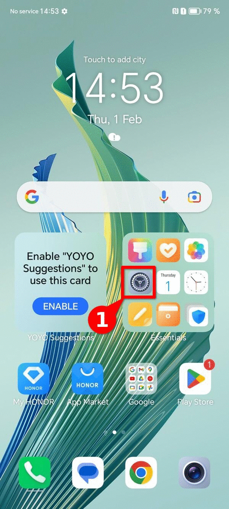
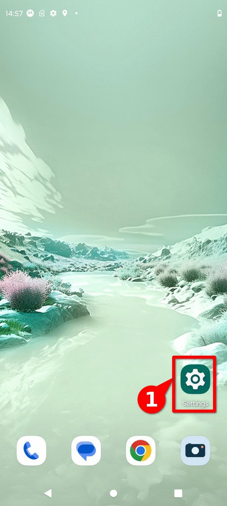
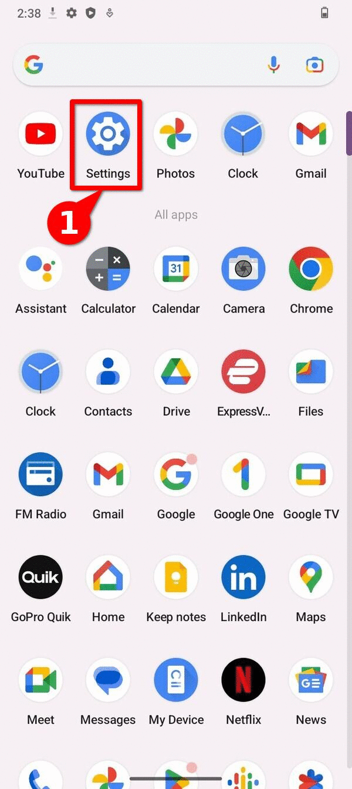
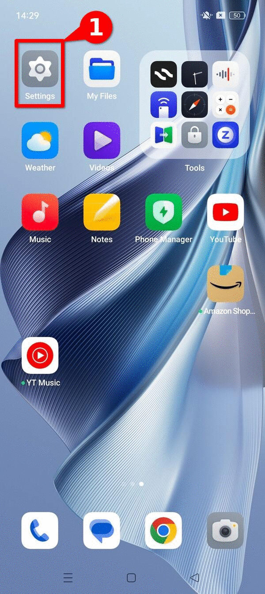
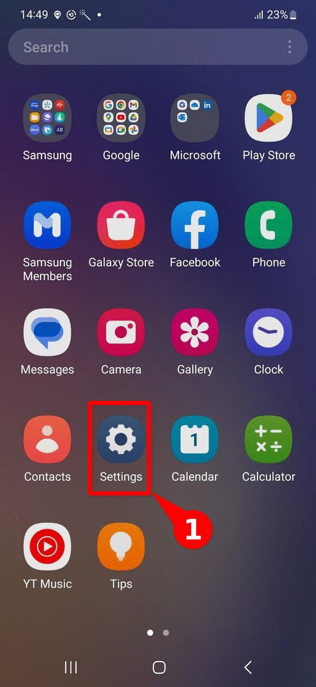
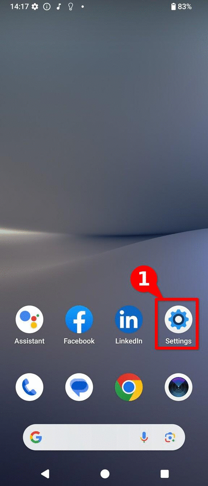

# Guía: ¿Cómo extraer un reporte de errores de un dispositivo Android?

Este documento forma **parte de un repositorio de documentación técnica** que tiene como objetivo establecer una base de conocimientos probados, flexibles y accesibles para **impulsar el análisis forense consentido en beneficio de la sociedad civil**. Para organizar los contenidos, se utiliza el marco de referencia de documentación técnica [Diataxis](http://../../references/glossary.md#diataxis).

Este recurso en particular se enmarca dentro de la categoría de **guías how-to**, y muestra los pasos necesarios para **generar un reporte de errores o *bugreport****,* tanto utilizando la **consola de depuración ADB** como a través de la **interfaz gráfica** de un dispositivo.  Este es un **material introductorio**, complementario a otros recursos, como el explainer de forense basada en logs para dispositivos Android y la guía para habilitar ADB; y **forma parte de los pasos a seguir para realizar un triaje inicial**.   

Agradecemos la **colaboración** del [laboratorio de seguridad de Reporteros Sin Fronteras](https://rsf.org/en/digital-security-lab), quienes brindaron las imágenes necesarias para la producción de esta guía.


## ¿Qué es un reporte de errores o *bugreport*?

Como su nombre lo indica, un *bugrpeort* o reporte de errores es un **compilado de registros e información** de diagnóstico que permiten **identificar y corregir errores** durante el desarrollo de aplicaciones. De forma nativa, el sistema operativo Android permite generar reportes de errores a través de la **interfaz gráfica y a través de la consola de ADB**.  

En el contexto del análisis forense consentido, el *bugreport* es un artefacto forense útil para el **triaje de dispositivos Android, incluyendo a través de la herramienta MVT**. Por ejemplo, el equipo de Amnesty Tech utilizó una técnica similar para la detección del software espía NoviSpy. 


## ¿Qué se necesita para extraer un *bugreport*?

A continuación se muestran los requisitos para extraer un bugreport a través de la interfaz gráfica (GUI) y de la consola ADB. 

=== "GUI"

    Para extraer un bugreport a través de la interfaz gráfica, **únicamente se requiere el dispositivo Android** a ser analizado .

    Para poder generar el bugreport, es necesario **activar el modo desarrollador** en el dispositivo Android a ser analizado. De ser necesario, consulte la guía sobre *¿Cómo habilitar el modo de desarrollador en diferentes modelos de Android?* 

=== "A través de ADB"

    Para extraer un bugreport a través de la consola de ADB es necesario: 

    * **El dispositivo Android a ser analizado**: Activar el [modo desarrollador](../../references/00-glossary.md#modo-de-desarrollador) y [activar la depuración por USB](../../references/00-glossary.md#adb). De ser necesario, consulta nuestras guías sobre habilitar opciones de desarrollador o la guía sobre cómo habilitar ADB   
    * **Computadora Windows, Linux o Mac:** Se utilizará para realizar la extracción.  
    * Tener un **cable para transferencia de archivos** telefono-computadora.


## Pasos para generar un _bugreport_ a través de la interfaz gráfica

En la mayor parte de los dispositivos Android es posible generar un reporte de errores sin necesidad de descargar herramientas adicionales, navegando únicamente a través de los menús del dispositivo.  Este será el **método de preferencia** **cuando se solicite a una persona defensora** compartir este artefacto forense. 

!!! Tip "Generar bugreport utilizando ADB"

    También es posible extraer un **reporte de errores desde la consola de ADB**. Este procedimiento podría ser más ágil y adecuado para personas analistas que desean extraer reportes de errores de varios dispositivos. 

    [:octicons-arrow-right-24: Llévame a las instrucciones](#pasos-para-generar-un-bugreport-a-través-de-la-interfaz-gráfica)

Debido a la forma en que se desarrolla el sistema operativo Android y a las capas de personalización que agrega cada fabricante, las **instrucciones exactas para generar un reporte de errores varían levemente**. A continuación presentamos las instrucciones para diferentes fabricantes y versiones del sistema operativo Android. 

!!! question "¿Por qué cambian las instrucciones entre diferentes dispositivos?"

    El sistema operativo Android basa su núcleo en el proyecto de código abierto [*Android Open Source Project*](https://source.android.com/)*.* Sin embargo, la [mayoría de fabricantes utilizan una versión propietaria de Google](https://www.makeuseof.com/tag/android-really-open-source-matter/), sobre la cuál se agregan capas de personalización adicionales, que en la mayoría de casos son también propietarias. 

    [:octicons-arrow-right-24: Lee más al respecto aquí](../02-como-habilitar-opciones-desarrollador/02-como-habilitar-opciones-desarrollador.md#por-qué-hay-diferentes-formas-de-habilitarlas)   


### Honor Magic 5 Lite (Magic OS) 

Para generar un reporte de errores es necesario **tener acceso a las opciones de desarrollador**. Si este menú aún no ha sido habilitado, puedes seguir estos **[pasos para habilitar las opciones de desarrollador en un dispositivo Honor](../02-como-habilitar-opciones-desarrollador/02-como-habilitar-opciones-desarrollador.md#honor-magic-os)**. 

Luego de habilitar las opciones de desarrollador, sigue estos **generar un reporte de errores**, mostrados en la **imagen 1**.  

1. Abre el menú de **Ajustes**
2. Navega hasta la última opción **Sistema**
3. Navega hasta la opción de **Opciones de desarrollador**
4. Selecciona la opción de “**Generar un reporte de errores”**
5. Escoge la opción de “**Reporte completo”**
6. Da tap en “**Reporte”**
7. Cuando esté **completo**, verás una notificación. Dale **tap para compartir**  
8. Se mostrará un **mensaje de alerta** sobre  información personal. Da tap en **Ok**  
9. Selecciona el mecanismo de preferencia y **comparte el bugreport**  


{: style="height:480x;width:216px"}
/// caption
**Imagen 1**.  Pasos para generar un reporte de errores en un dispositivo Honor Magic Lite con la versión Magic OS 7.1 en Android 13.
///


### Motorola (Hello UI)

Para generar un reporte de errores es necesario **tener acceso a las opciones de desarrollador**. Si este menú aún no ha sido habilitado, puedes seguir estos **[pasos para habilitar las opciones de desarrollador en dispositivos Motorola](../02-como-habilitar-opciones-desarrollador/02-como-habilitar-opciones-desarrollador.md#motorola-hello-ui)**.

Luego de habilitar las opciones de desarrollador, sigue estos **generar un reporte de errores**, mostrados en la **imagen 2**.  

1. Abre el menú de **Ajustes**  
2. Navega hasta la última opción **Sistema**  
3. Navega hasta la opción de **Opciones de desarrollador**  
4. Selecciona la opción de “**Generar un reporte de errores”**  
5. Escoge la opción de “**Reporte completo”**  
6. Da tap en “**Reporte”**   
7. Cuando esté **completo**, verás una notificación. Dale **tap para compartir**  
8. Se mostrará un **mensaje de alerta** sobre  información personal. Da tap en **Ok**  
9. Selecciona el mecanismo de preferencia y **comparte el bugreport** 

{: style="height:480x;width:216px"}
/// caption
**Imagen 2**. Pasos para generar un reporte de errores en un dispositivo Motorola Edge Neo 40 utilizando Hello UI en Android 13\.
///

### Nokia  

para generar un reporte de errores es necesario **tener acceso a las opciones de desarrollador**. Si este menú aún no ha sido habilitado, puedes seguir estos **[pasos para habilitar las opciones de desarrollador en dispositivos Nokia](../02-como-habilitar-opciones-desarrollador/02-como-habilitar-opciones-desarrollador.md#nokia)**. 

Luego de habilitar las opciones de desarrollador, sigue estos **generar un reporte de errores**, mostrados en la **imagen 3**.  

1. Abre el menú de **Ajustes**  
2. Navega hasta la última opción **Sistema**  
3. Navega hasta la opción de **Opciones de desarrollador**  
4. Selecciona la opción de “**Generar un reporte de errores”**   
5. Escoge la opción de “**Reporte completo”**  
6. Da tap en “**Reporte”**   
7. Cuando esté **completo**, verás una notificación. Dale **tap para compartir**  
8. Se mostrará un **mensaje de alerta** sobre  información personal. Da tap en **Ok**  
9. Selecciona el mecanismo de preferencia y **comparte el bugreport**  


{: style="height:480x;width:216px"}
/// caption
**Imagen 3**. Pasos para generar un reporte de errores en un dispositivo Nokia G42 5G utilizando Android 13\.
///

### Oppo (Magic OS)

Para generar un reporte de errores es necesario **tener acceso a las opciones de desarrollador**. Si este menú aún no ha sido habilitado, puedes seguir estos **[pasos para habilitar las opciones de desarrollador en dispositivos Oppo](../02-como-habilitar-opciones-desarrollador/02-como-habilitar-opciones-desarrollador.md#oppo-reno-10-color-os)**. 

Luego de habilitar las opciones de desarrollador, sigue estos **generar un reporte de errores**, mostrados en la **imagen 4**.  

1. Abre el menú de **Ajustes**  
2. Navega hasta la última opción **Herramientas Adicionales**  
3. Navega hasta la opción de **Opciones de desarrollador**  
4. Selecciona la opción de “**Reporte de errores”**   
5. Escoge la opción de “**Reporte completo”**  
6. Da tap en “**Reporte”**   
7. Cuando esté **completo**, verás una notificación. Dale **tap para compartir**  
8. Se mostrará un **mensaje de alerta** sobre  información personal. Da tap en **Ok**  
9. Selecciona el mecanismo de preferencia y **comparte el bugreport**  


{: style="height:480x;width:216px"}
/// caption
**Imagen 4**. Pasos para generar un reporte de errores en un dispositivo OPPO Reno 10 utilizando Android 13
///


### Realme (Realme UI)

Para generar un reporte de errores es necesario **tener acceso a las opciones de desarrollador**. Si este menú aún no ha sido habilitado, puedes seguir estos **[pasos para habilitar las opciones de desarrollador en un dispositivo Realme](../02-como-habilitar-opciones-desarrollador/02-como-habilitar-opciones-desarrollador.md#realme-realme-ui)**. 

Luego de habilitar las opciones de desarrollador, sigue estos **generar un reporte de errores**, mostrados en la **imagen 5**.  

1. Abre el menú de **Ajustes**  
2. Navega hasta la última opción **Herramientas adicionales**  
3. Navega hasta la opción de **Opciones de desarrollador**  
4. Selecciona la opción de “**Generar un reporte de errores”**   
5. Escoge la opción de “**Reporte completo”**  
6. Da tap en “**Reporte”**   
7. Cuando esté **completo**, verás una notificación. Dale **tap para compartir**  
8. Se mostrará un **mensaje de alerta** sobre  información personal. Da tap en **Ok**  
9. Selecciona el mecanismo de preferencia y **comparte el bugreport**  


{: style="height:480x;width:216px"}
/// caption
**Imagen 5**. Pasos para generar un reporte de errores en un dispositivo Realme GT2 Pro con RealMe UI 4.0 utilizando Android 13
///

### Samsung (One UI)

Para generar un reporte de errores es necesario **tener acceso a las opciones de desarrollador**. Si este menú aún no ha sido habilitado, puedes seguir estos **[pasos para habilitar las opciones de desarrollador en un dispositivo Samsung](../02-como-habilitar-opciones-desarrollador/02-como-habilitar-opciones-desarrollador.md#samsung-one-ui)**. 

Luego de habilitar las opciones de desarrollador, sigue estos **generar un reporte de errores**, mostrados en la **imagen 6**.  

1. Abre el menú de **Ajustes**  
2. Navega hasta la opción de **Opciones de desarrollador**  
3. Selecciona la opción de “**Generar un reporte de errores”**   
4. Escoge la opción de “**Reporte completo”**  
5. Da tap en “**Reporte”**   
6. Cuando esté **completo**, verás una notificación. Dale **tap para compartir**  
7. Se mostrará un **mensaje de alerta** sobre  información personal. Da tap en **Ok**  
8. Selecciona el mecanismo de preferencia y **comparte el bugreport**  

{: style="height:480x;width:216px"}
/// caption
**Imagen 6**. Pasos para generar un reporte de errores en un dispositivo Samsung Galaxy A54 con One UI en un dispositivo utilizando Android 13
///

### Sony (Xperia UI)


Para generar un reporte de errores es necesario **tener acceso a las opciones de desarrollador**. Si este menú aún no ha sido habilitado, puedes seguir estos **[pasos para habilitar las opciones de desarrollador en dispositivos Sony](../02-como-habilitar-opciones-desarrollador/02-como-habilitar-opciones-desarrollador.md#sony-xperia-ui)**.

Luego de habilitar las opciones de desarrollador, sigue estos **generar un reporte de errores**, mostrados en la **imagen 7\.**  

1. Abre el menú de **Ajustes**  
2. Navega hasta la última opción **Sistema**  
3. Navega hasta la opción de **Opciones de desarrollador**  
4. Selecciona la opción de “**Generar un reporte de errores”**   
5. Escoge la opción de “**Reporte completo”**  
6. Da tap en “**Reporte”**   
7. Cuando esté **completo**, verás una notificación. Dale **tap para compartir**  
8. Se mostrará un **mensaje de alerta** sobre  información personal. Da tap en **Ok**  
9. Selecciona el mecanismo de preferencia y **comparte el bugreport**  

{: style="height:480x;width:216px"}
/// caption
**Imagen 7**. Pasos para generar un reporte de errores en un dispositivo Sony Xperia 10V con Xperia UI 4.0 utilizando Android 14\.
///


### Tecno (Hi OS)

Para generar un reporte de errores es necesario **tener acceso a las opciones de desarrollador**. Si este menú aún no ha sido habilitado, puedes seguir estos **[pasos para habilitar las opciones de desarrollador en dispositivos Tecno](../02-como-habilitar-opciones-desarrollador/02-como-habilitar-opciones-desarrollador.md#tecno-hi-os)**.  . 

Luego de habilitar las opciones de desarrollador, sigue estos **generar un reporte de errores**, mostrados en la **imagen 8\.**  

1. Abre el menú de **Ajustes**  
2. Navega hasta la última opción **Sistema**  
3. Navega hasta la opción de **Opciones de desarrollador**  
4. Selecciona la opción de “**Generar un reporte de errores”**   
5. Escoge la opción de “**Reporte completo”**  
6. Da tap en “**Reporte”**   
7. Cuando esté **completo**, verás una notificación. Dale **tap para compartir**  
8. Se mostrará un **mensaje de alerta** sobre  información personal. Da tap en **Ok**  
9. Selecciona el mecanismo de preferencia y **comparte el bugreport**  

{: style="height:480x;width:216px"}
/// caption
**Imagen 8**. Pasos para generar un reporte de errores en un dispositivo Tecno Spark Go con Hi OS utilizando Android 13.
///

### Xiaomi (Hyper OS)

Para generar un reporte de errores es necesario **tener acceso a las opciones de desarrollador**. Si este menú aún no ha sido habilitado, puedes seguir estos **pasos para habilitar las opciones de desarrollador en un dispositivo Xiaomi**. 

Luego de habilitar las opciones de desarrollador, sigue estos **generar un reporte de errores**, mostrados en la **imagen 9\.**  

1. Abre el menú de **Ajustes**  
2. Navega hasta la última opción **Sobre el dispositivo**  
3. Navega hasta la opción de **Información detallada del dispositivo**  
4. Ubica la información correspondiente al **CPU y da tap 5 veces**   
5. Verás una notificación de alerta sobre información personal. Dale click en **Estoy de acuerdo**    
6. Cuando esté **completo**, verás una notificación. **Dale tap** para ir a la carpeta de archivos 
7. **Ubica el reporte de errores recién generado** y dale clic para compartir. 
8. Selecciona el mecanismo de preferencia y **comparte el bugreport**  

{: style="height:480x;width:216px"}
/// caption
**imagen 9**. Pasos para generar un reporte de errores en un dispositivo Xiaomi 13T.
///


## Pasos para generar un *bugreport* a través de la consola ADB

Además del método para generar un reporte de errores a través de la interfaz gráfica, es posible generar un reporte de errores a través de la consola ADB siguiendo estos pasos. Es importante recordar que antes de seguir estas instrucciones, debes habilitar la depuración por USB. 

### Generar el reporte de errores

Si tienes **solo un dispositivo conectado**, puedes obtener un informe de errores con adb, de la siguiente manera:

```
$ adb bugreport
```


Si **no especificas una ruta** de acceso para el informe de errores, se guardará en el **directorio local**. Si deseas incluir una ruta específica, la puedes agregar como parámetro de la siguiente forma: 

```
$ adb bugreport E:\Reports\MyBugReportsPath

```

!!! warning "Múltiples dispositivos"

    Si tienes **varios dispositivos conectados**, debes **especificar el dispositivo con la opción \-s**. Ejecuta el comando `adb devices` para obtener el número de serie del dispositivo y generar el informe de errores:

    ```
    $ adb devices
    List of devices attached
    emulator-5554      device
    8XV7N15C31003476 device

    $ adb -s 8XV7N15C31003476 bugreport

    ```

### Extraer el reporte de errores

Una vez que se envía la señal al dispositivo para generar el reporte de errores, es posible **extraerlo directamente a la computadora** desde donde se está ejecutando ADB. 

Primero, debemos **identificar el reporte de errores a extraer**. Se puede utilizar el comando  `adb shell ls /bugreports/` para ver los reportes almacenados, que por defecto estarán en la carpeta `/bugreports/.` 

```
$ adb shell ls /bugreports/
bugreport-foo-bar.xxx.YYYY-MM-DD-HH-MM-SS-dumpstate_log-yyy.txt
bugreport-foo-bar.xxx.YYYY-MM-DD-HH-MM-SS.zip
dumpstate-stats.txt
```

Una vez que se identifica el reporte de errores a extraer, se puede **copiar a la computadora** a través del siguiente comando: 

```
$ adb pull /bugreports/bugreport-foo-bar.xxx.YYYY-MM-DD-HH-MM-SS.zip
```

Una vez se ejecute este comando, el archivo se **copiará al directorio desde donde se esté ejecutando ADB**. 

## Conclusión

**Un bugreport** hace referencia a un reporte de errores generado por el sistema operativo Android, y que incluye información útil, ideada especialmente para la depuración de errores durante el desarrollo de aplicaciones. Sin embargo, **muchos de los registros y comportamientos que se incluyen dentro del *bugreport* son de utilidad para el análisis forense**. Extraer el reporte de errores, es uno de los primeros pasos en el ciclo de una investigación, y es una forma frecuente de iniciar un proceso de triaje en dispositivos Android. 

Debido a la **diversidad de fabricantes** y versiones del sistema operativo Android hemos presentado en este material una lista de fabricantes e **instrucciones paso a paso para generar un bugreport**, y así **facilitar y promover el análisis forense consentido** en beneficio de la sociedad civil. Recuerdo siempre discutir y obtener un consentimiento informado antes de extraer información forense. 

Si **tienes acceso a una interfaz gráfica que no se muestra en la lista**, y deseas incorporar la captura correspondiente a este recurso, puedes escribirnos a través de un *issue* o, si te sientes cómodo con markdown, puedes enviar una solicitud de integración a través de un *pull request.*   


## Comentarios

¿Tienes **comentarios o sugerencias** sobre este recurso? Puedes utilizar la **función de comentar que se muestra a continuación** para dejarnos tus ideas o apreciaciones. Por favor asegúrate de seguir nuestro [código de conducta](../../comunidad/codigo-de-conducta.md). La función de comentarios enlaza directamente a la sección de [_Discussions_ de Github](https://github.com/Socialtic/forensics/discussions), donde también **puedes participar en las discusiones de forma directa**, si lo prefieres.   

