# Tutorial - Explorando AndroidQF para la adquisición de información en Android

Este documento forma **parte de un repositorio de documentación técnica** que tiene como objetivo establecer una base de conocimientos probados, flexibles y accesibles para **impulsar el análisis forense consentido en beneficio de la sociedad civil**. Para organizar los contenidos, se utiliza el [marco de referencia de documentación técnica Diataxis](../../references/00-glossary/index.md#diataxis).

Este recurso en particular se enmarca dentro de la categoría de [tutoriales](https://diataxis.fr/tutorials/), y contiene actividades prácticas guiadas para familiarizarse con una extracción forense a través de la herramienta [AndroidQF](https://github.com/mvt-project/androidqf).

Este tutorial tiene el **objetivo de enseñar de forma práctica, clara y accesible cómo usar AndroidQF** para realizar extracciones forenses en dispositivos Android, destacando su utilidad en contextos de análisis de amenazas e incidentes que afectan a personas defensoras de derechos humanos, periodistas y organizaciones de la sociedad civil.


!!! tip "¿Cómo seguir este tutorial?"

    Este tutorial pretende ser un **recurso para el aprendizaje**, por lo que algunos conceptos se exploran a profundidad, mostrando también alternativas y posibilidades. Si buscas una guía concisa, con instrucciones paso a paso para completar una extracción, consulta nuestra [guía de adquisición con androidqf.](../../how-tos/04-how-to-extract-with-androidqf/)
    
    Se recomienda destinar un espacio de tiempo de al menos **90 minutos para la exploración inicial**, es especial si no se cuenta con experiencia previa en la herramienta. 

## Requisitos para seguir este tutorial

Para poder completar este tutorial es **indispensable** contar con  los siguientes elementos:

* Un **dispositivo  Android**. El dispositivo debe funcionar y se debe conocer su contraseña, PIN o patrón de desbloqueo, este debe contar con la **depuración USB activa**.

    !!! question "¿Cómo habilitar la depuración por USB?"

        Si el dispositivo no tiene activa esta configuración, es necesario que primero sigas los pasos sobre [¿Cómo habilitar las opciones de desarrollador en diferentes dispositivos Android?](../../how-tos/02-how-to-enable-developer-options/) y posteriormente, seguir los pasos sobre [¿Cómo habilitar ADB (depuración por USB) en diferentes dispositivos Android?](../../how-tos/03-how-to-enable-adb/). 

* Un **equipo de cómputo** con un sistema operativo Windows, Linux o macOS reciente.

* Cable USB para **transferencia de datos** en buen estado 

    !!! info "No todos los cables USB son iguales"

        Algunos cables USB no tienen las conexiones necesarias para transferir datos entre el dispositivo móvil y la computadora. Estos cables son útiles para cargar nuestro dispositivo, pero no funcionan para transferir información. Para la extracción, asegúrate de utilizar un cable que permita transferir datos. Es [difícil distinguirlos a simple vista](https://support.konnected.io/how-to-tell-a-usb-charge-only-cable-from-a-usb-data-cable), pero usualmente los cables de carga rápida o aquellos incluidos con los dispositivos suelen ser cables de datos. 

## Acerca de AndroidQF

[AndroidQF](https://github.com/mvt-project/androidqf) es una herramienta de software libre y de código abierto **enfocada en la extracción forense de dispositivos Android**. Forma parte del [MVT Project](https://github.com/mvt-project/), desarrollada inicialmente por [Claudio Guarnieri](https://nex.sx/) y es mantenida actualmente por el [Laboratorio de Seguridad de Amnistía Internacional](https://securitylab.amnesty.org/es/). 

Su nombre viene del inglés *Android Quick Forensics* (Forense Rápido en Android), y su diseño y elaboración están enfocados en **facilitar la adquisición de información para realizar análisis forenses consensuados** en contexto  de la sociedad civil.

AndroidQF es destacado dentro de los grupos técnicos que realizan extracciones como una **[herramienta portable](../../references/00-glossary/index.md#herramienta-portable) de fácil uso, ya que puede ejecutarse en Windows, Linux y macOS** mediante binarios precompilados.

### ¿Qué hace AndroidQF a nivel técnico?

Técnicamente, AndroidQF es un [wrapper](https://developer.mozilla.org/en-US/docs/Glossary/Wrapper) forense sobre [ADB](../../references/00-glossary/index.md#adb), esto significa que automatiza comandos ADB empaquetados en [módulos](https://github.com/mvt-project/androidqf/tree/main/modules) que ejecutan operaciones específicas y que siguen un flujo concreto. 

Algunas de los componentes generales de AndroidQF son:

* **Interfaz de ejecución.** Muestra una interfaz de línea de comandos con la que interactúa la persona y genera el registro de toda la actividad durante la ejecución.  
* **Gestión de módulos.** Maneja el flujo de ejecución específico de cada módulo.  
* **Extracción forense.** Realiza la adquisición de datos forenses usando comandos adb.

### ¿Por qué es útil para hacer análisis forense en sociedad civil?

Su diseño permite realizar **extracciones rápidas y seguras de  dispositivos Android**, sin necesidad de herramientas comerciales o configuraciones avanzadas. 

Esto la convierte en una herramienta accesible y confiable para investigadores, defensores de derechos humanos, periodistas y laboratorios de análisis forense digital, especialmente porque:

* **Puede usarse de manera portable** sin necesidad de realizar una instalación compleja.  
* El **control de la información forense es a nivel local** y no se comparten datos por algún servicio web o nube  
* Su modularidad **permite decidir exactamente qué datos obtener**, esto según el nivel de riesgo de una persona.  
* La herramienta y su documentación entran en la categoría de **software libre y código abierto**, por lo que su código fuente es transparente y consultable por cualquier persona interesada en conocer cómo funciona la herramienta.

La facilidad para conocer qué información forense fue extraída y cuál fue el proceso, permite brindar mayor transparencia y confianza al proceso, de forma tal que se reduzcan los riesgos técnicos y éticos del análisis forense consensuado.

De forma complementaria a este tutorial, en este repositorio se encuentra un [Diccionario de archivos generados por la herramienta androidqf](../../references/01-reference-androidqf-dictionary/), un material de referencia que contiene **información acerca de los archivos generados**, cómo utilizarlos, donde buscar información específica y en qué formato la encontrará.

## Revisión de configuraciones en el dispositivo Android

Para iniciar este tutorial, es importante **confirmar las configuraciones necesarias en el dispositivo Android y del equipo de cómputo**, esto asegurará que haya una buena transmisión de información entre dispositivos al realizar la extracción forense.

Con la depuración USB activa, es momento de **conectar el dispositivo móvil al equipo de cómputo** a través del cable de transferencia de archivos. Cuando conectes el teléfono, selecciona **permitir** en el momento en que el dispositivo Android **solicite permiso de acceso a los datos del dispositivo.**

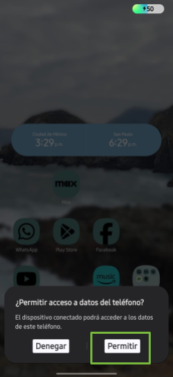
/// caption
**Imagen 1**. Captura de pantalla de dispositivo móvil Android Samsung solicitando permiso de acceso a datos.
///
    
Posteriormente verifica en el panel de notificaciones que el dispositivo se encuentra conectado en modo **USB para transferir archivos** (ver imagen 2), para ello, da clic en la notificación de Sistema Android Y selecciona *USB para Transferir archivos/Android Auto* )ver imagen 3). Si no se observa ninguna notificación, puedes revisar las **configuraciones de usb** en el menú de ajustes del dispositivo, verificando que la opción de _transferencia de archivos_ se encuentra habilitada. 


/// caption
**Imagen 2**. Captura de pantalla del panel de notificaciones en dispositivo móvil android.
///

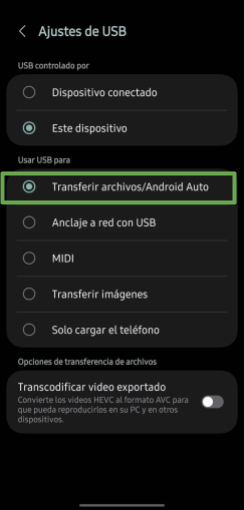
/// caption
**Imagen 3**. Captura de pantalla de dispositivo móvil Android con los ajustes de uso USB para transferir archivos.
///

## Obteniendo AndroidQF

En esta sección se detalla **cómo descargar el binario y preparar tu computadora** para ejecutar AndroidQF. Además, para profundizar en la puesta a punto del binario y **explorar una alternativa**, se muestran los pasos para compilar tu propio binario en un sistema Linux. 

### Descarga e instalación de AndroidQF desde su repositorio oficial

Para comenzar necesitas descargar el [binario](../../references/00-glossary/index.md#binario) de AndroidQF desde su [repositorio oficial de GitHub](https://github.com/mvt-project/androidqf/releases/).

Es importante que consideres que la descarga correcta del binario **depende de la arquitectura de tu procesador y de tu sistema operativo**. A continuación te mostramos los detalles para sistemas operativos Windows y Linux/MacOS. 


!!! info "Disponibilidad en Windows"

    El repositorio oficial de AndroidQF únicamente cuenta con el binario de Windows para una arquitectura amd64, por lo que si tu **arquitectura en Windows es arm, no podrás continuar con este tutorial** a menos que cuentes con un sistema operativo **Linux o macOS particionado o virtualizado** en tu equipo de computo.


=== "Linux y MacOS"

    En Linux y macOS: Abre la terminal y escribe *uname \-m*. La salida de este comando te dirá la arquitectura de tu procesador (x86\_64 o arm64). La imagen 4 muestra un ejemplo en un sistema Linux. 

    
    /// caption
    **Imagen 4**. Captura de pantalla de terminal de Linux con la salida del comando *uname \-m.*
    ///

    Dependiendo de esta salida, descarga el binario correspondiente en la lista de descargas del [repositorio oficial de AndroidQF](https://github.com/mvt-project/androidqf/releases/). La imagen 5 muestra la lista de descargas. 

    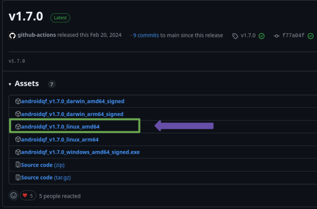
    /// caption
    **Imagen 5**. Captura de pantalla de lista de descargas de androidqf en el repositorio oficial de github.
    ///

    En la imagen 6 se muestra el archivo descargado, en este caso particular la versión 1.7.0. La versión podría variar conforme se realicen actualizaciones a la herramienta. 

    
    /// caption
    **Imagen 6**. Imagen de referencia de descarga de binario de AndroidQF en su versión 1.7.0 para sistema Linux amd64
    ///

    Opcionalmente, puedes mover el binario descargado a una carpeta exclusiva de la herramienta o a una carpeta donde realices extracciones forenses, aunque puedes mantener el binario en la carpeta de descargas.   

    
    /// caption
    **Imagen 7**. Captura de pantalla de terminal de linux con ejecución de comando *mv* para mover el binario descargado
    ///

    Una vez que tengas el binario en la carpeta de preferencia, es necesario asignar permisos de ejecución a AndroidQF, para ello debes usar el comando, ejemplificado en la imagen 8:

    ```shell
    chmod +x ./androidqf-XXX
    ```

    
    /// caption
    **Imagen 8**. Captura de pantalla de terminal de linux con ejecución de comando *chmod \+x* para agregar permisos de ejecución al binario
    ///


=== "Windows"

    Como se indicó anteriormente, para sistemas operativos Windows **solamente existe un binario disponible**, que llevará un nombre similar a _androidqf_v1.7.0_windows_amd64_signed.exe_. Para obtener AndroidQF debes descargar este archivo. En la imagen 9 mostramos una carpeta con el binario (archivo _.exe_) descargado. 
    

    
    /// caption
    **Imagen 9**. Captura de pantalla del explorador de archivos de Windows con la carpeta del binario en la carpeta donde se guardará la extracción forense.
    ///

    Opcionalmente, puedes mover el binario descargado a una carpeta exclusiva de la herramienta o a una carpeta donde realices extracciones forenses, aunque puedes mantener el binario en la carpeta de descargas.

!!! failure "Conflictos con Antivirus"

    En caso de que tu equipo de cómputo Windows o macOS cuente con algún **antivirus** instalado, es posible que este software pueda prevenir y detener la descarga y ejecución de AndroidQF. Por lo tanto, en caso de tener problemas con la descarga o ejecución, te recomendamos que lo **desactives temporalmente.** Algunos antivirus pueden identificar el binario de AndroidQF como una amenaza y aplicar reglas de seguridad sobre la ejecución de este. 
    
    Si tienes **Windows Defender, no es necesario que lo desactives.** 

### Alternativa: Compilación de binario de AndroidQF para Linux

Adicionalmente, en este tutorial te presentamos la alternativa de **compilar el binario de AndroidQF** para Linux. Esta opción te brinda la posibilidad de generar el binario directamente en tu sistema y evitar depender únicamente de los binarios publicados en los lanzamientos oficiales. Esto **no es un paso obligatorio**, pero te permite comprender como utilizar el repositorio de código para generar el archivo ejecutable paso a paso. 

Si no deseas explorar la compilación, o estás utilizando un equipo con Windows, puedes continuar el tutorial en la sección de [exploración y ejecución de AndroidQF](#exploracion-y-ejecucion-androidqf)

!!! Tip "Integridad del binario de AndroidQF"

    Compilar el proyecto desde el código fuente también te da la ventaja de verificar la integridad del software, tener el binario construido a partir de las últimas actualizaciones en el código fuente de la herramienta y asegurarte de que el binario se adapta a tu propio entorno de trabajo.

**Paso 1 - Actualiza el sistema** 

Utiliza el gestor de paquetes para asegurarse de que todo esté al día. 

```shell
sudo apt update && sudo apt upgrade -y
```

**Paso 2 - Instala las dependencias requeridas** 

Go 1.23, make, git, unzip y wget. Es importante no usar la versión de Go incluida en los repositorios, ya que es antigua. 

Si tienes una instalación previa, elimínala con:

```shell
sudo apt remove --purge -y golang-go golang
sudo rm -rf /usr/local/go
```

Ahora descarga e instala la versión oficial de Go, para este ejemplo se está utilizando la 1.23 pero es necesario **descargar la más reciente**.

```shell
cd /tmp
wget https://go.dev/dl/go1.23.1.linux-amd64.tar.gz
sudo tar -C /usr/local -xzf go1.23.1.linux-amd64.tar.gz
```

Agrega Go al PATH para que el sistema lo reconozca:

```shell
export PATH=/usr/local/go/bin:$PATH
```

Una vez hecho esto se recomienda confirmar la versión de Go instalada

```shell
go version
```

**Paso 3 - Clona el repositorio**

Con el entorno listo, se clona el repositorio oficial de AndroidQF desde GitHub y se ingresa en la carpeta descargada. 

```shell
cd ~
git clone https://github.com/mvt-project/androidqf.git
cd androidqf
```

**Paso 4 -Compila el binario** 

Dentro del proyecto lo primero es compilar el módulo collector, que es el encargado de ejecutarse en los dispositivos Android durante la extracción. 

```shell
make collector
```

Espera hasta que termine la construcción del collector, tal y como se muestra en la figura 10. .


/// caption
**Imagen 10**. Captura de pantalla de terminal de linux con ejecución de comando *build collector.*
///

Posteriormente se compila la versión de AndroidQF para Linux utilizando la instrucción. tal y como se muestra en la figura 11. 

```shell
make linux
```


/// caption
**Imagen 11**. Captura de pantalla de terminal de linux con ejecución de comando *make linux.*
///

Al finalizar la compilación se generan los binarios dentro de la carpeta *build*. Para ello puedes listar la carpeta y confirmar la compilación de los binarios con el siguiente comando, tal y como se muestra en la figura 12: 

```shell
ls build/
```


/// caption
**Imagen 12**. Captura de pantalla de terminal de linux con ejecución de comando *ls build/.*
///

Para comprobar que todo salió bien puedes pasar a la siguiente sección donde abordará la exploración de esta herramientas.

## Exploración y ejecución AndroidQF

### Exploración de AndroidQF 

En esta sección vamos a explorar AndroidQF, para conocer los parámetros de ejecución que tiene la herramienta. **Entenderlos te permitirá controlar y personalizar el tipo de extracción forense que deseas realizar**, estos parámetros son parte de los comandos que guían a la herramienta para que funcione correctamente. 

AndroidQF integra una lista completa de parámetros disponibles a través de su parámetro *\- –help* (o su forma abreviada *\-h*). Esto funciona en Linux, macOS y WIndows mediante el siguiente comando:

```shell

./androidqf_vXXX_ --help
```

=== "Comando help en Linux/MacOS"

    Ejemplo en Linux:

    
    /// caption
    **Imagen 13**. Captura de pantalla de terminal de Linux con ejecución de parámetro *–help*.
    ///

=== "Comando help en Windows"

    Ejemplo en Windows: 

    En la carpeta donde tienes guardado el binario de AndroidQF da clic derecho y selecciona opción Abrir en terminal, tal y como se muestra en la imagen 14:

    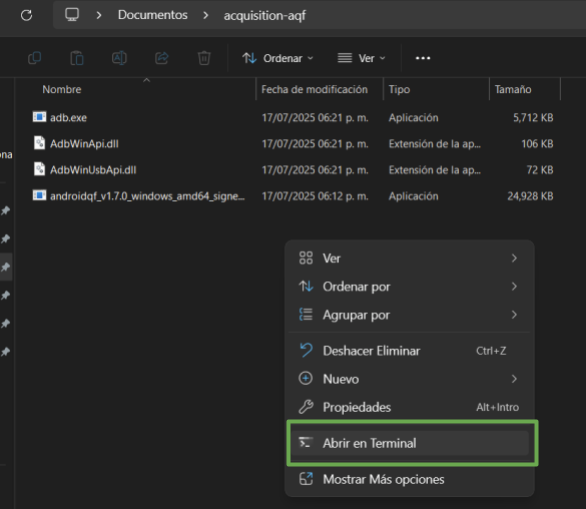
    /// caption
    **Imagen 14**. Captura de pantalla de carpeta de Windows con el menú derecho activo y la opción *abrir en terminal* identificado
    ///    

    Una vez en la termina, puedes ejecutar el comando con el parámetro *–help*, tal y como se muestra en la imagen 15.   

    
    /// caption
    **Imagen 15**. Captura de pantalla de terminal de Windows Powershell con el parámetro *–help* ejecutado.
    ///

Esto muestra un menú de ayuda en la terminal con todos los parámetros disponibles. Los más importantes al realizar una extracción forense son los siguientes:

* *\-s*: Si tienes varios dispositivos conectados, puedes usar este parámetro para especificar el dispositivo a analizar.

=== "Identificar dispositivos en Linux/MacOS"

    En el caso de macOS y Linux puedes listar los dispositivos con adb, te dejamos esta guía de [Cómo instalar ADB en macOS y Linux](https://www-xda--developers-com.translate.goog/install-adb-windows-macos-linux/?_x_tr_sl=en&_x_tr_tl=es&_x_tr_hl=es&_x_tr_pto=tc).
	  
	El comando para listar dispositivos en macOS y Linux es:

    ```shell
    adb devices
    ```

    El resultado se muestra en la imagen 16. 

    
    /// caption
    **Imagen 16**. Captura de pantalla de terminal de linux con ejecución de comando *adb devices.*
    ///

=== "Identificar dispositivos en Windows"

    En el caso de Windows, cuando ejecutas el binario de AndroidQF por primera vez, se crea el ejecutable de ADB y se puede utilizar para listar los dispositivos:

    ```shell
    .\adb.exe devices 
    ```
    
    El resultado se muestra en la imagen 17. 

    
    /// caption
    **Imagen 17**. Captura de pantalla de terminal de Windows PowerShell con ejecución del ejecutable *adb* y el parámetro *devices.*
    ///


    Una vez que se identifican los dispositivos conectados, es posible agregar el numero de serie utilizando el parámetro -s, tal y como se muestra en la imagen 18. 

    ```shell
    ./androidqf -s numero-serial
    ```

    
    /// caption
    **Imagen 18**.  Captura de pantalla de terminal de Linux con integración del parámetro *\-s*.
    ///


* \-o: Te permite indicar un output o carpeta de salida donde se guardarán los archivos extraídos.  

    Si no se especifica un output o una carpeta de salida, AndroidQF identificará el dispositivo una vez que permita la depuración USB y generará una carpeta con un identificador único (UUID). En esta carpeta se almacenará la extracción. El nombre de estas carpetas al ser un UUID suele tener nombres como 0caba18f-20a7-48d0-b9ba-724fdaa3ff85 o a577ae94-0a47-479c-82c5-c8017bfb7175.

    Como ejemplo en este tutorial, se utiliza el parámetro *\-o* para definir la carpeta de salida de la extracción en lugar de dejar que AndroidQF genere un UUID. De esta manera, el comando creará una carpeta que tendrá un nombre más legible, que combina la fecha en formato año-mes-día con un texto adicional de identificación, que en esta ejemplificación llamaremos *acquisition01*.

    ```shell
    ./androidqf -s numero-serial -o "$(date +%Y-%m-%d)"-identificador
    ```

    
    /// caption
    **Imagen 19**.  Captura de pantalla de terminal de linux con integración del parámetro *\-o*.
    ///


* *\--verbose* o *\-v*: Opcionalmente puede activar el modo detallado. La terminal mostrará información en tiempo real del proceso, útil para la depuración. Esta información es la misma que se guarda en el archivo [*command.log*](https://forensics.socialtic.org/references/01-reference-diccionario-androidqf/01-reference-diccionario-androidqf.html#commandlog) generado automáticamente después de cada ejecución.

    ```shell
    ./androidqf -s numero-serial -o "$(date +%Y-%m-%d)"-complemento-opcional -v
    ```

    
    /// caption
    **Imagen 20**.  Captura de pantalla de terminal de linux con integración del parámetro *\-v*.
    ///


### Ejecución de AndroidQF 

Antes de ejecutar el binario de AndoridQF, enciende y desbloquea el dispositivo móvil que ya conectaste al equipo de computo. 

Sin importar cuál sistema operativo utilices en tu equipo de cómputo, primero es necesario identificar los parámetros del comando de ejecución de AndroidQF según las necesidades de tu análisis. Para este ejemplo utilizamos el siguiente comando: 


```shell
./androidqf -s numero-serial -o /ruta/de/salida/"$(date +%Y-%m-%d)"-complemento # (1)!
```

1. Utilizamos los parámetros **-s** para indicar el número serial y **-o** para especificar la ruta de salida. Utilizamos también el comando **date** para incluir de forma automática la fecha en el nombre de la carpeta. 

=== "Ejecución en Linux/MacOS"

    Para ejecutar AndroidQF en un sistema Linux/MacOS, debemos abrir una terminal en la ubicación donde almacenamos el binario y ejecutar el comando que presentamos anteriormente.  

    ```shell
    ./androidqf -s numero-serial -o /ruta/de/salida/"$(date +%Y-%m-%d)"-acquisition01
    ```

    En la imagen 21 te presentamos un ejemplo de la salida en un sistema Linux. 

    
    /// caption
    **Imagen 21**.  Captura de pantalla de terminal de Linux con comando de ejecución preparado.
    ///

=== "Ejecución en Windows"

    Para iniciar la ejecución en Windows, es posible utilizar la terminal o el explorador de archivos. 

    === "Terminal"

        Con tu terminal abierta en la carpeta donde se encuentra el binario de AndoridQF, ejecuta el binario mediante el comando con los parámetros necesarios según tu análisis (similar al caso de Linux y macOS)

        ```shell
        ./androidqf.exe -s numero-serial -o "$(Get-Date -Format 'yyyy-MM-dd')-acquisition01
        ```

        
        /// caption
        **Imagen 22**. Captura de pantalla de la terminal de Windows PowerShell con comando de ejecución preparado.
        ///

    === "Explorador de archivos"

        En la carpeta donde se guardó el binario se puede ejecutar el binario con doble clic.

        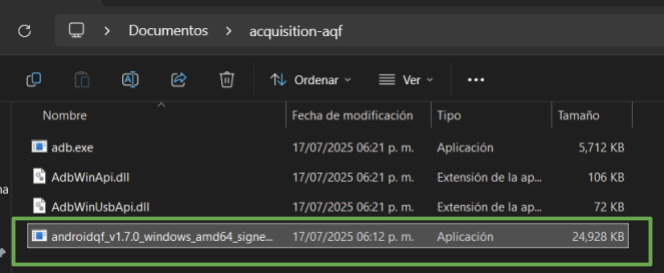
        /// caption
        **Imagen 23**. Captura de pantalla del explorador de archivos con la carpeta de descarga del binario de androidqf.
        /// 
    
    
    Una vez que ejecutes el binario, aparecerá un **mensaje de protección de Windows** diciendo que el sistema evitó ejecutar la aplicación para evitar riesgos, sin embargo, al ser AndroidQF una herramienta libre y de código abierto con constantes mejoras no hay una distribución comercial.

    Para ello da clic en **“Más información”** 

    
    /// caption
    **Imagen 24**. Captura de pantalla de ventana emergente de protección de Windows.
    /// 

    Selecciona **“Ejecutar de todas formas”**

    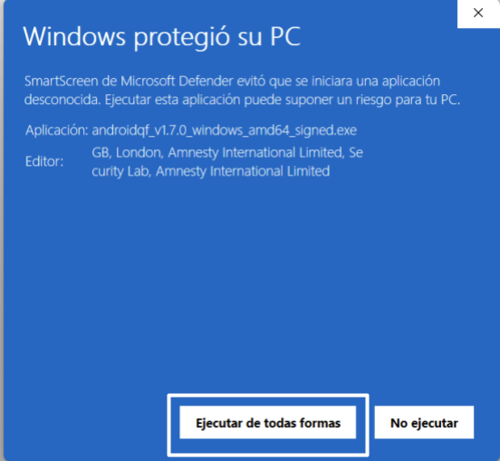
    /// caption
    **Imagen 25**. Captura de pantalla de ventana emergente de protección de Windows con la selección de *Ejecutar de todas formas*.
    /// 

### Consideraciones durante la ejecución 

!!! info "Pasos equivalentes para todos los sistemas"

    Los próximos pasos se aplicarán de la **misma manera** en los 3 sistemas operativos considerados en este tutorial: **Linux, Windows and macOS.**    

Esta sección contempla las acciones y consideraciones **una vez que comienza la ejecución**, es decir, en cuanto ejecutamos el comando mostrado en la sección anterior. 

Cuando inicia la ejecución, es necesario realizar algunas configuraciones en la terminal y otras el dispositivo Android. Estas configuraciones son secuenciales, por lo que es **recomendable que estar alerta del proceso de ejecución de la extracción**, a continuación se mencionan estas configuraciones de manera explícita:

1. **:material-cellphone-basic: - en el teléfono:** Cuando aparezca el mensaje ***¿Permitir depuración por USB?***, da clic en ***“Permitir siempre desde esta computadora”*** y luego ***“Aceptar”*** o ***“Permitir”***.  

    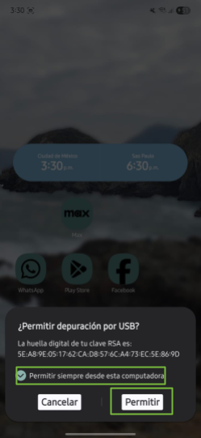
    /// caption
    **Imagen 26**. Captura de pantalla de dispositivo móvil Android Samsung solicitando permiso de depuración y confianza al equipo de cómputo para transferir archivos.
    /// 


2. **:octicons-terminal-16: - en la terminal:** Posteriormente AndroidQF preguntará el tipo de respaldo que realizará la herramienta:

    * **Only** **SMS**: Realiza un respaldo limitado que incluye solo mensajes SMS y MMS.  
    * **Everything**: Ejecuta un respaldo completo del dispositivo mediante adb backup.  
    * **No** **Backup**: Omite completamente la generación de respaldos; solo extrae otros artefactos vía ADB.
	  
    !!! note "Nota"

        Para el ejemplo usamos la opción **Only-SMS** para limitar la extracción únicamente a mensajes, reduciendo la exposición de datos personales innecesarios. Si el contexto del caso se considera de alto riesgo o implica investigación más sofisticada se recomienda marcar la opción  **Everything**, aunque la opción **Only-SMS** en la mayoría de los casos sigue siendo suficiente para buscar intentos de phishing mediante SMS.*

    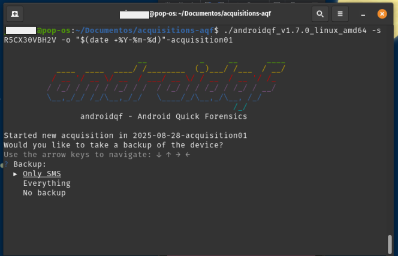
    /// caption
    **Imagen 27**. Captura de pantalla de terminal de linux con el menú backup de AndroidQF y la opción *Only-SMS* seleccionada.
    /// 


3. **:material-cellphone-basic: - en el teléfono:** Al seleccionar el tipo de respaldo, el teléfono solicitará utilizar una contraseña temporal de cifrado para este. En nuestro ejemplo utilizamos **la contraseña “sd”** de seguridad digital en español,**** tal y como se muestra en la figura 28. 

    !!! note "Sobre la definición de contraseñas para el respaldo"

        En este paso, la herramienta solicita una contraseña para el cifrado del respaldo. Para este ejemplo utilizaremos la contraseña "sd" de seguridad digital.

        Dependiendo del contexto y el caso puedes elegir la contraseña adecuada, aunque si se realizan extracciones de manera continua se puede utilizar la misma contraseña como una practica interna de tu equipo.

        Si bien reutilizar contraseñas no es una práctica de seguridad digital recomendada, es importante considerar el contexto y recordar que está contraseña protegerá únicamente uno de los archivos incluidos en la extracción forense. Sin embargo, los demás archivos recolectados no estarán cifrados, por lo que independientemente de la contraseña que se utilice, debemos manejar la carpeta de extracción como información sensible, y almacenarla únicamente en medios con medidas y estándares de protección adicional de acuerdo a nuestra política interna de manejo y protección de la información.

    
    /// caption
    **Imagen 28**. Captura de pantalla de dispositivo móvil Android Samsung solicitando la contraseña temporal del backup.
    /// 


4. **:material-cellphone-basic: - en el teléfono:** Posteriormente selecciona el botón**: “Copia de seguridad de mis datos”.**

    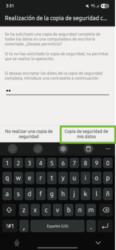
    /// caption
    **Imagen 29**. Captura de pantalla de dispositivo móvil Android Samsung con la opción “Copia de seguridad de mis datos” seleccionada.
    /// 

    En la terminal :octicons-terminal-16:: Para este momento, AndroidQF estará realizando la copia de seguridad y recolectando la información del backup y la información de las aplicaciones (paquetes) instalados en el dispositivo.

    !!! warning "Errores en las rutas"

        En algunas ocasiones, suelen aparecer errores sobre la búsqueda de las rutas donde se encuentran los paquetes, por lo que es común ver algunas de estas marcas de error, sin embargo, **estas marcas de error no afectan la extracción de datos forenses en el dispositivo.***

    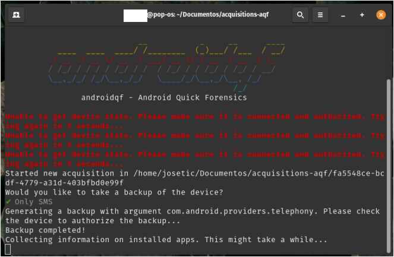
    /// caption
    **Imagen 30**. Captura de pantalla de terminal de Linux indicando la recolección de información de paquetes de aplicaciones por parte de AndroidQF.
    /// 

5. **:octicons-terminal-16: - en la terminal:** Cuando AndoridQF encuentra todos los paquetes instalados en el dispositivo preguntará qué tipo de copia de las aplicaciones se desea realizar, para ello hay 3 opciones:  

    * **All**: Descarga los APK de todas las aplicaciones, incluidas las del sistema.
    * **Only** **non-system** **packages**: Descarga solo los APK de aplicaciones instaladas por el usuario.
    * *Do** **not** **download** **any**: Omite completamente la descarga de APKs del dispositivo.

	  
	La recomendación en este punto, es que los analistas realicen la descarga de los paquetes que no son del sistema (Only non-system packages) para permitir el análisis posterior en busca de comportamientos maliciosos, modificaciones, rastreadores, etc.

    !!! note "¿Cuál opción es la ideal?"

        Aunque nuestra recomendación es seleccionar “Only non-system packages”, la selección depende de tu enfoque de análisis e investigación, por lo que en casos con sospechas de ataques sofisticados se puede utilizar la opción “All”.*

    
    /// caption
    **Imagen 31**. Captura de pantalla de terminal de linux con el menú copias de paquetes de aplicaciones de AndroidQF y la opción “*Only non-system packages”* seleccionada.
    /// 


6. **:octicons-terminal-16: - en la terminal:** Una vez seleccionada la opción de descargas de copias de paquetes, AndroidQF preguntará acerca de eliminar los APKs firmados por desarrolladores o entidades confiables (como Google o el fabricante del dispositivo), esto con el fin de reducir el tamaño de la carpeta de extracción.

	  
	Responde “Yes” para que, al realizar la revisión de la información se pueda enfocar el análisis en los paquetes que sean potencialmente sospechosos, además de que ahorrará tiempo y espacio de almacenamiento.

    !!! note "¿Cuál opción es la ideal?"

        Aunque nuestra recomendación es seleccionar “Yes”, la selección depende de tu enfoque de análisis e investigación, por lo que en casos con sospechas de ataques sofisticados se puede utilizar la opción “No”.
    
    
    /// caption
    **Imagen 32** Captura de pantalla de terminal de Linux con el menú de omisión de aplicaciones con certificado confiable de AndroidQF y la opción Yes seleccionada.
    /// 

    Para este punto, se ejecutarán múltiples tareas de adquisición, como la recopilación de propiedades del dispositivo, logs del sistema, procesos en ejecución, configuraciones, archivos temporales, etc. que explicaremos una a una en la siguiente sección.

    !!! info "Duración del proceso"
    
        **Esta etapa puede tomar varios minutos**, dependiendo del modelo del teléfono y la cantidad de datos almacenados. El progreso se muestra línea por línea en la terminal y no requiere intervención adicional, salvo al final, donde se debe presionar Enter para completar.

    
    /// caption
    **Imagen 33** Captura de pantalla de terminal de linux con información de ejecución correcta de la extracción forense con AndroidQF y solicitando presionar *“Enter”* para terminar.
    /// 

Una vez que finalice el proceso de adquisición, la herramienta habrá capturado los archivos e informaciones clave necesarias para un [triaje](../../references/00-glossary/index.md#triaje). 

## Verificación de la extracción

Una vez finalizada la ejecución de AndroidQF, es importante validar que la adquisición se completó correctamente. Para ello, realiza los siguientes pasos:

1. Revisar el archivo *command.log*

    Abre el archivo *command.log* con un editor de texto y busca las palabras *WARNING* y *ERROR* para encontrar alertas durante la extracción. Si hay coincidencias en la búsqueda revisa si corresponden a fallos críticos o eventos no relevantes.


	=== "En Linux/MacOS" 
        
        Puedes usar el comando *grep* para realizar una búsqueda dentro de la carpeta de la adquisición:

        ```shell
        grep -i "WARNING\|ERROR" command.log
        ```

        La salida estará en texto plano:

        ```shell
        2025-07-28T13:05:36-06:00 [ERROR] Failed to get file paths for package com.adobe.reader: exit status 1: 
        2025-07-28T13:05:55-06:00 [ERROR] Failed to get file paths for package com.whova.event: exit status 1: 
        2025-07-28T13:07:27-06:00 [ERROR] Failed to get file paths for package im.vector.app: exit status 1: 
        2025-07-28T13:10:09-06:00 [ERROR] Failed to get file paths for package sh.file.opener.shell.editor.app: exit status 1: 
        2025-07-28T13:29:51-06:00 [DEBUG] From: /data/system/uiderrors.txt
        2025-07-28T13:29:51-06:00 [DEBUG] To: /home/lightyear/Documentos/ST/ST2025/extracciones qf/a7de07b3-36d8-4589-9854-1bc666c2c873/logs/data/system/uiderrors.txt
        2025-07-28T13:29:51-06:00 [ERROR] Failed to pull log file /data/system/uiderrors.txt: 
        2025-07-28T13:29:51-06:00 [ERROR] Failed to pull log file /proc/kmsg: 
        2025-07-28T13:29:51-06:00 [ERROR] Failed to pull log file /proc/last_kmsg: 
        2025-07-28T13:29:51-06:00 [ERROR] Failed to pull log file /sys/fs/pstore/console-ramoops: 
        2025-07-28T13:29:51-06:00 [ERROR] Failed to pull log file /data/anr/: 
        2025-07-28T13:29:51-06:00 [ERROR] Failed to pull log file /data/anr/anr_2025-07-23-03-47-27-988: 
        2025-07-28T13:29:52-06:00 [ERROR] Failed to pull log file /data/log/: 
        2025-07-28T13:30:00-06:00 [ERROR] Failed to pull log file /data/log/settingsprovider.txt: 
        2025-07-28T13:30:00-06:00 [ERROR] Failed to pull log file /data/log/dark_mode_log0.txt.lck: 
        2025-07-28T13:30:00-06:00 [ERROR] Failed to pull log file /data/log/dark_mode_log0.txt: 
        2025-07-28T13:30:00-06:00 [ERROR] Failed to pull log file /data/log/knoxsdk.log.0.lck: 
        2025-07-28T13:30:00-06:00 [ERROR] Failed to pull log file /data/log/knoxsdk.log.0: 
        2025-07-28T13:30:00-06:00 [ERROR] Failed to pull log file /data/log/LockSettingsLog_Enroll.log: 
        2025-07-28T13:30:01-06:00 [ERROR] Failed to pull log file /data/log/setupwizard.txt: 
        2025-07-28T13:30:01-06:00 [ERROR] Failed to pull log file /data/log/appwidget_history_log0.txt.lck: 
        2025-07-28T13:30:01-06:00 [ERROR] Failed to pull log file /data/log/appwidget_history_log0.txt: 
        2025-07-28T13:30:01-06:00 [ERROR] Failed to pull log file 
        ```

        La imagen 34 muestra la salida de búsqueda de errores en un sistema Linux.

        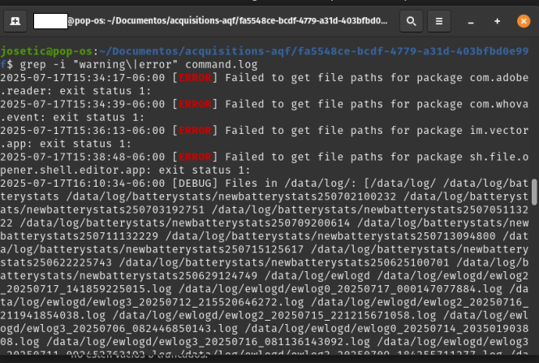
        /// caption
        **Imagen 34** Captura de pantalla de terminal de linux con el comando *grep* para buscar errores en el archivo command.log generado por AndoridQF.
        /// 

	=== "En Windows" 

        Abre el archivo con *Bloc de notas*. Si usas Windows en español presiona  la combinación de teclas **ctrl+b** y si usas WIndows en inglés o portugues, utiliza  **ctrl+f.** Luego escribe ***WARNING*** y ***ERROR*** en el cuadro de búsqueda.

        La figura 35 muestra la salida de una búsqueda de errores en Windows. en este caso, no se encuentran  errores referentes al proceso de extracción forense.

        
        /// caption
        **Imagen 35** Captura de pantalla de Bloc de notas de Windows con la búsqueda de  errores en el archivo command.log generado por AndoridQF.
        ///


2. Verifica la existencia del archivo *acquisition.json* y abrelo

	Este archivo resume los detalles de la extracción. Su creación implica que AndroidQF finalizó correctamente la extracción forense del dispositivo. 

    Ejemplo de la salida del archivo *acquisition.json*:

    ```
    {
    "uuid": "a7de07b3-36d8-4589-9854-1bc666c2c873",
    "androidqf_version": "f77a04f",
    "storage_path": "/home/user/acquisition/folder qf/a7de07b3-36d8-4589-9854-1bc666c2c873",
    "started": "2025-07-28T19:02:46.15453512Z",
    "completed": "2025-07-28T19:30:22.947074074Z",
    "collector": {
    "ExePath": "/data/local/tmp/collector",
    "Installed": false,
    "Adb": {
    "ExePath": "/usr/bin/adb",
    "Serial": ""
    },
    "Architecture": "arm64-v8a"
    },
    "tmp_dir": "/data/local/tmp/",
    "sdcard": "/sdcard/",
    "cpu": "arm64-v8a"
    }
    ```

3. Comprueba la creación de archivos y carpetas de salida

Asegurate que se hayan generado los siguientes archivos y carpetas:

* Archivos  
  * acquisition.json  
  * backup.ab  
  * bugreport.zip  
  * command.log  
  * dumpsys.txt  
  * env.txt  
  * files.json  
  * getprop.txt  
  * hashes.csv  
  * logcat.txt  
  * packages.json  
  * processes.txt  
  * root\_binaries.json  
  * selinux.txt  
  * services.txt  
  * settings\_global.txt  
  * settings\_secure.txt  
  * settings\_system.txt  
* Carpetas de salida  
  * apks/  
  * logs/  
  * tmp/

	  
Esto significa que los módulos se ejecutaron correctamente.


/// caption
**Imagen 36** Captura de pantalla de la aplicación archivos en PopOS\! mostrando la carpeta de salida de archivos y directorios generados con la extracción forense con AndroidQF.
///

Identificar que una extracción fue realizada exitosamente implica un proceso de análisis, de habilidad y de instinto para leer líneas con distintos formatos e identificar todos los nombres de los archivos de salida. Todo tu esfuerzo ayuda a que la comunidad refuerce estas herramientas para hacerlas mejor en la sociedad civil.

## Conclusión  

¡Felicidades! Has completado con éxito el proceso de adquisición forense con AndroidQF. Ejecutar una extracción de información forense no es una tarea sencilla, pero ahora dominas los pasos esenciales para realizar extracciones seguras, documentadas y con consentimiento. AndroidQF te permitirá como analista a apoyar en investigaciones desde tu laboratorio, organización o causa si eres  analista independiente sobre vigilancia, amenazas digitales y documentación de incidentes o ataques digitales. Tus nuevas habilidades son cruciales para reforzar el uso de estas herramientas en beneficio de muchas comunidad y la sociedad civil.

Ahora que tienes la extracción, el siguiente paso es que puedas interpretar la información obtenida, pues una vez que una extracción fue realizada exitosamente es necesario comenzar un proceso de análisis de la información contenida en esta extracción.

Para apoyarte en este análisis, este repositorio incluye un recurso de referencia clave: el [Diccionario de archivos generados por AndroidQF](../../references/01-reference-androidqf-dictionary/). Con este recurso, podrás:

* Identificar el contenido de cada archivo de salida.  
* Comprender por qué esta información es importante y cómo usarla en un análisis forense.  
* Entender el formato en el que se entrega la información y cómo visualizarla.

El siguiente paso es realizar un análisis más profundo de la información adquirida. 
