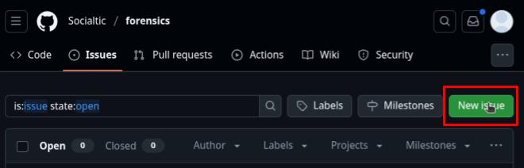

---

title: Comunidad - ¿Cómo colaborar con este repositorio?
summary: Paso a paso para contribuciones en github
keywords: forense, comunidad, contribucion
lang: es
tags: [comunidad, issue, pull request, commit, github intro]
last_updated: 2025-07-14
some_url:
author:
    name: Daniel
    url: https://socialtic.org/quienes-somos/
    description: SocialTIC

translation-review-pending: true
---

# Como contribuir para este repositório?

O repositório está atualmente no GitHub, portanto, há **duas maneiras principais** de contribuir com esse repositório:

* [***Issues***](https://github.com/Socialtic/forensics/issues): *questões* ou **problemas são relatórios ou solicitações relacionados ao conteúdo** do repositório.  Exemplos de *issues* são relatos de erros de ortografia, correções de links, melhorias na escrita, entre outros. Não é necessário estar familiarizado com o github, o markdown ou a estrutura de conteúdo para relatar um problema. Os *problemas* relatados receberão uma resposta da equipe de gerenciamento do repositório.

* [***Pull request***](https://github.com/Socialtic/forensics/pulls): *pull requests* **são solicitações de integração em que é solicitado que alterações** sejam aplicadas ao repositório, com frequência, para melhorar, corrigir ou expandir o conteúdo do repositório. **As *pull requests* são analisadas pela equipe de projeto responsável** e, se forem consideradas adequadas, serão aprovadas e incluídas na versão pública do repositório.

## Propostas de melhorias ou correções por meio de problemas

Se você encontrar um bug ou tiver uma proposta de melhoria **[você pode iniciar uma *questão* ou um problema no repositório seguindo este link] (https://github.com/Socialtic/forensics/issues/new)**. Por meio da *questão*, será possível sugerir, discutir e implementar alterações e aprimoramentos no conteúdo. Não importa se o erro é simples, como um erro de ortografia: **Gostamos muito de receber relatórios de aprimoramento de conteúdo**.

Ao levantar um problema, pedimos que você use o formato descrito no documento [*issue template*] (https://github.com/Socialtic/forensics/blob/main/.github/ISSUE_TEMPLATE/official_template.md), que será carregado automaticamente quando você tentar abrir um novo *problema* no repositório, conforme mostrado na **imagem 1**.

{ loading=lazy }
/// legenda
**imagem 1.** Guia Problemas no repositório forense, para gerar um novo problema, use o botão novo problema no canto superior direito da interface da Web do GitHub.
///

Quando você *clica* no botão, é apresentada a opção de selecionar um formato. Selecione a opção *modelo de problema*, conforme mostrado em **imgaen 2.**.

Pop-up para selecionar um modelo, na guia *issues* do repositório forense. Pop-up ao clicar no botão de novo *assunto ](../../../../../assets/community/community-new-issue-pop-up.jpg "image 2")
/// legenda
**Pop-up para selecionar um modelo, na guia *issues* do repositório forense. Aparece quando você clica no botão de novo problema.
///

O uso da opção de um formato predefinido, como o *modelo de problema*, abrirá uma interface na qual você poderá editar o texto do problema a ser relatado usando o formato recomendado. Recomendamos **usar o *template* pré-carregado e remover** as seções que não forem relevantes, conforme mostrado na **imagem 3.**.

Exemplo de relato de um *problema* por meio da GUI do GitHub no repositório forense](../../../assets/community/community-new-template.jpg "image 3")
/// legenda
**Exemplo de relatório de um *problema* por meio da GUI do GitHub no repositório forense.
///

## Solicitações de integração via *pull request*.

Para **propor uma integração de alterações no repositório**, você pode seguir as etapas abaixo:

**Usando **sua própria conta do Github (ou uma conta organizacional, se preferir),** faça [uma bifurcação] (https://docs.github.com/en/pull-requests/collaborating-with-pull-requests/working-with-forks/fork-a-repo) ou *bifurcação* do repositório.

!!! dica "Recomendação"
    Você pode fazer isso no navegador da Web em [github.com](http://github.com), usando o botão **"Fork "** no canto superior direito do [repositório principal](https://github.com/Socialtic/forensics), conforme mostrado na **imagem 4.

Interface do GitHub para o repositório forense, destacando a opção de bifurcar o repositório](../../../../../assets/community/community-fork-tab.jpg "image 4")
/// legenda
**Interface do GitHub para o repositório forense, onde a opção de bifurcar o repositório é destacada.
///

**A partir do *fork* do repositório, crie uma nova ramificação ou *branch* onde você pode fazer alterações.

!!! dica "Recomendação"
    - Use **nomes descritivos** para suas ramificações, como "fix-guia-acquisition", "add-tutorial-analyzing-mvt-bugreport".
    - Você pode fazer isso no github clicando na seção *"branches "*, conforme mostrado na **imagem 5**.   

Interface do GitHub para a bifurcação do repositório forense, onde a seção para consultar ramificações está destacada](../../../../../assets/community/community-fork-branch-tab.jpg "image 5")
/// legenda
**Interface do GitHub para a bifurcação do repositório forense, destacando a seção para consultar as ramificações.
///

Na seção *branches*, é possível criar uma nova ramificação ou *branch* **dentro da sua cópia ou *fork* do repositório**, conforme mostrado na **imagem 6**.

Interface do GitHub para o *fork* do repositório forense na seção branches, onde a opção de criar um novo branch está destacada](../../../assets/community/community-fork-new-branch.jpg "image 6")
/// legenda
**image 6** Interface do GitHub para o *fork* do repositório forense na seção branches, onde a opção de criar um novo branch é destacada.
///

**Etapa 3** **Faça suas alterações e faça *commits*** claros, especificando as alterações ou ajustes feitos. A imagem 7** mostra um exemplo de um *commit*.

!!! dica "Recomendação"
    - Siga as recomendações oficiais do [Git Guides' recommendations for making *commits*] (https://github.com/git-guides/git-commit).
    - Quando você fizer alterações em um documento por meio da interface da Web, o GitHub fará o commit do branch ou *branch* ao qual as alterações devem ser aplicadas. Use o ramo que você criou.

Interface do GitHub para o repositório forense, mostrando o formulário a ser preenchido ao fazer uma alteração ou confirmação](.../.../.../assets/community/community-fork-commit.jpg "image 7")
/// legenda
**Interface do GitHub para o repositório forense, mostrando o formulário a ser preenchido ao fazer uma alteração ou confirmação.
///

**Etapa 4.** Abrir uma solicitação pull.   

!!! dica "Recomendação".
    - Siga o formato estabelecido descrito no [modelo de pull request] (https://docs.google.com/document/d/1elOOTVjq389TSSrClmDtlTEiYsCHXQCadvZfFzHmfs4/edit?tab=t.0#heading=h.j3djtr277ooi) e envie sua solicitação de integração.   
    - Você pode enviar a solicitação usando a interface da Web do Github e clicando na opção apresentada para fazer uma solicitação de integração após fazer alterações em um branch, conforme mostrado na **imagem 8.**.

Interface do GitHub para uma bifurcação do repositório forense, mostrando a opção de comparar e enviar uma solicitação pull para o repositório principal](../../../../assets/community/community-fork-compare-pull-request.jpg "image 8")
/// legenda
**Interface do GitHub para uma bifurcação do repositório forense, mostrando a opção de comparar e enviar uma solicitação de integração para o repositório principal.
///

A imagem 9** mostra os detalhes de uma solicitação de integração, usando o formato predefinido.

Interface do GitHub para uma bifurcação de repositório forense, mostrando os detalhes de uma pull request. ](../../../assets/community/community-pull-request-template.jpg "image 9")
/// legenda
**Interface do GitHub para uma bifurcação do repositório forense, mostrando os detalhes de um pull request.
///

Quando sua pull request for **revisada e aceita**, ela se parecerá com a mostrada na **imagem 10**. Isso também significa que suas alterações foram **aplicadas diretamente ao repositório principal** publicado em forensics.socialtic.org.

Interface do GitHub para o repositório forense, mostrando a revisão e a integração de uma pull request](../../../../../assets/community/community-pull-request-example.jpg "image 10.
/// legenda
**Interface do GitHub para o repositório forense, mostrando a revisão e a integração de uma pull request.
///

## Recursos adicionais

Também são bem-vindos **recursos adicionais** que possam fortalecer a prática forense na sociedade civil, **mesmo que não sigam** a estrutura [Ditaxis] (https://diataxis.fr/). Dependendo do conteúdo, você pode publicar em sua forma original nos recursos da comunidade ou colaborar para adaptá-lo à estrutura.

Para essas colaborações, escreva para nós em: [**seguridad@socialtic.org**](mailto:seguridad@socialtic.org)
