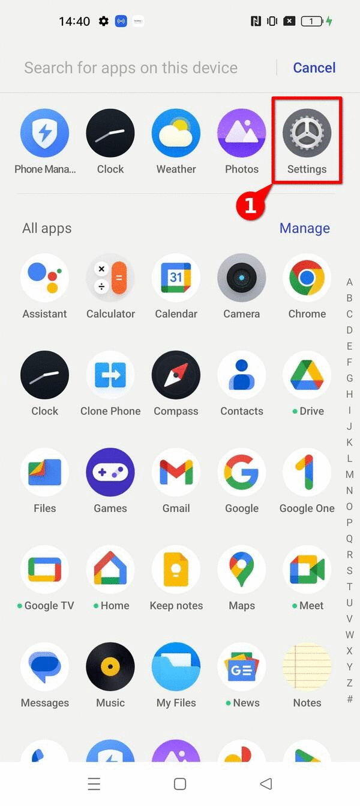
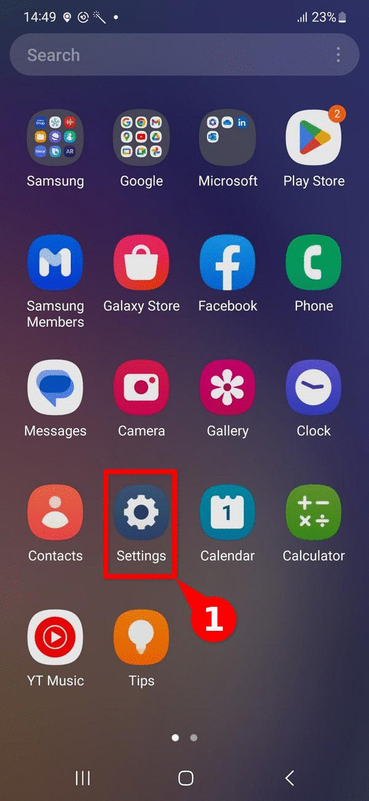
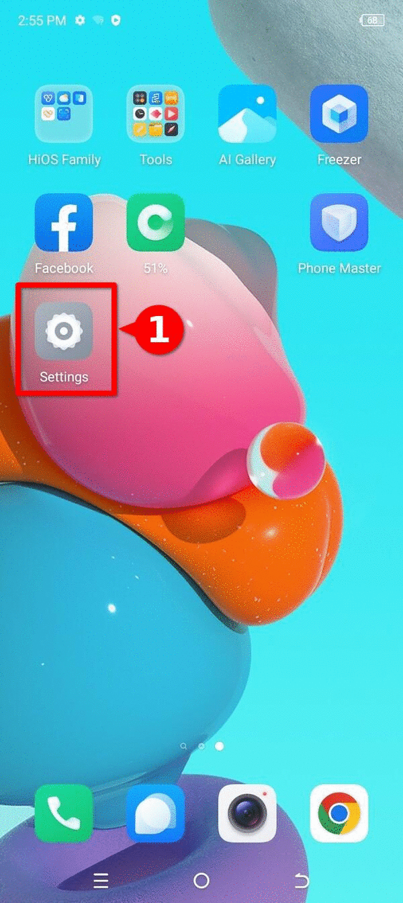

---

title: ¿Cómo habilitar ADB en diferentes dispositivos Android?
summary: Cómo habilitar ADB en diferentes dispositivos Android.
keywords: triage, android, ADB, debug bridge, usb debug
lang: es
tags: [how-to, intro]
last_updated: 2025-07-30
some_url:
created: 2025-07-30
comments: true
author:
    name: Daniel
    url: https://socialtic.org/quienes-somos/
    description: SocialTIC

translation-review-pending: true
---

# Guia: Como ativar o ADB em diferentes dispositivos Android?

Este recurso se enquadra na categoria de **guias de instruções** e mostra as etapas a serem seguidas para **ativar a depuração USB ou *Android Debug Bridge* em diferentes dispositivos Android**, bem como uma breve explicação sobre **o que é a depuração USB** e **por que ela é útil** ao fazer perícia digital. Este é um material **introdutório**, complementar a outros recursos, como o [explicador forense baseado em registro para dispositivos Android](../../explainers/03-explainer-log-forensics-android/) e o [guia para ativar as opções do desenvolvedor](../how-tos/02-as-enabling-developer-options/02-as-enabling-developer-options.html) ; e **faz parte das etapas a serem seguidas para realizar a triagem inicial**.   

Somos gratos pela **colaboração** do [Reporters Without Borders security lab] (https://rsf.org/en/digital-security-lab), que forneceu os insumos iniciais necessários para a produção deste guia.

## O que é *ADB* ou depuração USB e por que ela é útil?

ADB significa *Android Debug Bridge*. O ADB é uma **ferramenta de linha de comando** **que permite que você se comunique diretamente via USB com um dispositivo Android** e inicie diferentes ações e comandos.  

Do ponto de vista da **forense digital** e, em particular, ao fazer [investigações baseadas em logs](../../explainers/03-explainer-log-forensics-android/) usando ferramentas como o AndroidQF, o **ADB permite estabelecer comunicação direta com um dispositivo**. Ele é útil em situações em que **você tem acesso físico ao dispositivo** e quando deseja obter informações diretamente do dispositivo por meio de **comandos nativos**, sem usar ferramentas adicionais.

## Como ativar o ADB?

Em geral, a depuração de USB ou ADB **é encontrada no menu [developer-options] (../../references/00-glossary/index.md#developer-mode)**. Portanto, se esse menu ainda não tiver sido ativado, siga as instruções correspondentes para ativá-lo.

Abaixo estão os **passos a seguir para diferentes modelos e versões** do sistema operacional Android.

Pergunta "Por que as instruções mudam entre dispositivos diferentes?"

    O sistema operacional Android baseia seu núcleo no projeto de código aberto [*Android Open Source Project*](https://source.android.com/)*.* No entanto, [a maioria dos fabricantes usa uma versão proprietária do Google](https://www.makeuseof.com/tag/android-really-open-source-matter/), sobre a qual são adicionadas camadas de personalização adicionais, que, na maioria dos casos, também são proprietárias.

    [:octicons-arrow-right-24: Leia mais sobre isso aqui](../02-how-to-enable-developer-options/index.md#why-there-are-different-ways-of-enabling-them)

### Google (Pixel OS)

Para ativar o **ADB**, você precisa ter acesso às opções do desenvolvedor. Se esse menu ainda não tiver sido ativado, você pode seguir estas **[etapas para ativar as opções do desenvolvedor no Pixel](../02-how-to-enable-developer-options/index.md#google-pixel-os)**.   

Depois de ativar as opções de desenvolvedor, siga estas **etapas para ativar o ADB**, demonstradas na **imagem 2**.  

1. abra o menu **Configurações ⚙️**.
2. navegue até a última opção **System and Updates 📱** 3.
3. navegue até a opção **Developer Options 🤖**.
4. Ative a primeira opção **USB Debugging 🖥️**
5. **Confirme** que deseja ativar a depuração USB no menu pop-up ✅

Etapas para ativar o ADB em um dispositivo Google Pixel com Android 13](.../../../../../assets/03-how-to/activating-adb-honor-magic-lite.gif "image 1"){: style="height:480x;width:216px"}
/// legenda
**Imagem 1**. Etapas para ativar o ADB em um dispositivo Google Pixel com Android 13.
///

### Honor (Magic OS)

Para ativar o **ADB**, você precisa ter acesso às opções do desenvolvedor. Se esse menu ainda não tiver sido ativado, você pode seguir estas **[etapas para ativar as opções do desenvolvedor no Honor](../02-how-to-enable-developer-options/index.md#honor-magic-os)**.

Depois de ativar as opções de desenvolvedor, siga estas **etapas para ativar o ADB**, mostradas na **imagem 2**.  

1. abra o menu **Configurações ⚙️**.
2. navegue até a última opção **System and Updates 📱** 3.
3. navegue até a opção **Developer Options 🤖**.
4. Ative a primeira opção **USB Debugging 🖥️**
5. **Confirme** que deseja ativar a depuração USB no menu pop-up ✅

Etapas para ativar o ADB em um dispositivo Honor Magic Lite executando o Magic OS 7.1 no Android 13](../../../../../assets/03-how-to/activating-adb-honor-magic-lite.gif "image 2"){: style="height:480x;width:216px"}
/// legenda
**Imagem 2**.  Etapas para ativar o ADB em um dispositivo Honor Magic Lite com a versão Magic OS 7.1 no Android 13.
///

### Motorola (Hello UI)

Para ativar o **ADB**, você precisa ter acesso às opções do desenvolvedor. Se esse menu ainda não tiver sido ativado, você pode seguir estas **[etapas para ativar as opções do desenvolvedor em dispositivos Motorola](../02-how-to-enable-developer-options/index.md#motorola-hello-ui)**.

Depois de ativar as opções do desenvolvedor, siga estas **etapas para ativar o ADB**, mostradas na **figura 3**.  

1. abra o menu **Settings (Configurações) ⚙️**.
2. navegue até a última opção **System 📱** 3.
3. navegue até a opção **Developer Options 🤖**.
4. Habilite a primeira opção **USB Debugging 🖥️** 5.
5. **Confirme** que deseja ativar a depuração USB no menu pop-up ✅

Etapas para ativar o ADB em um dispositivo Motorola Edge Neo 40 usando o Hello UI no Android 13](../../../../../assets/03-how-to/activating-adb-motorola-edge-40-neo.gif "image 4"){: style="height:480x;width:216px"}
/// legenda
**imagem 3**. Etapas para ativar o ADB em um dispositivo Motorola Edge Neo 40 usando o Hello UI no Android 13.
///

### Nokia

Para ativar o **ADB**, você precisa ter acesso às opções do desenvolvedor. Se esse menu ainda não tiver sido ativado, você pode seguir estas **[etapas para ativar as opções do desenvolvedor em dispositivos Nokia](../02-how-to-enable-developer-options/index.md#nokia)**.

Depois de ativar as opções do desenvolvedor, siga estas **etapas para ativar o ADB**, demonstradas na **imagem 4**.  

1. abra o menu **Configurações ⚙️**.
2. navegue até a última opção **Sistema 📱** 3.
3. navegue até a opção **Developer Options 🤖**.
4. Habilite a primeira opção **USB Debugging 🖥️** 5.
5. **Confirme** que deseja ativar a depuração USB no menu pop-up ✅

Etapas para ativar o ADB em um dispositivo Nokia G42 5G usando o Android 13](../../../assets/03-how-to/activating-adb-nokia-g42.gif "image 4"){: style="height:480x;width:216px"}
/// legenda
**Imagem 4**. Etapas para ativar o ADB em um dispositivo Nokia G42 5G usando o Android 13.
///

### Oppo (Magic OS)

Para ativar o **ADB**, você precisa ter acesso às opções do desenvolvedor. Se esse menu ainda não tiver sido ativado, você pode seguir estas **[etapas para ativar as opções do desenvolvedor**. Depois de ativar as opções do desenvolvedor, siga estas **[etapas para ativar as opções do desenvolvedor em dispositivos Oppo](../02-how-to-enable-developer-options/index.md#oppo-reno-10-color-os)**.

Depois de ativar as opções de desenvolvedor, siga estas **etapas para ativar o ADB**, demonstradas na **imagem 5**.  

1. abra o menu **Configurações ⚙️**.
2. navegue até a última opção **Additional Tools 📱** 3.
3. navegue até a opção **Developer Options 🤖**.
4. Ative a terceira opção **USB Debugging 🖥️**
5. **Confirme** que deseja ativar a depuração USB no menu pop-up ✅

{: style="height:480x;width:216px"}
/// legenda
**Imagem 5**. Etapas para ativar o ADB em um dispositivo OPPO Reno 10 usando o Android 13
///

### Realme (Realme UI)

Para ativar o **ADB**, você precisa ter acesso às opções de desenvolvedor. Se esse menu ainda não tiver sido ativado, você pode seguir estas **[etapas para ativar as opções de desenvolvedor nos dispositivos Realme](../02-how-to-enable-developer-options/index.md#realme-realme-ui)**.

Depois de ativar as opções de desenvolvedor, siga estas **etapas para ativar o ADB**, demonstradas na **imagem 6**.  

1. abra o menu **Settings (Configurações) ⚙️**.
2. navegue até a última opção **Additional Tools 📱** 3.
3. navegue até a opção **Developer Options 🤖**.
4. Ative a terceira opção **USB Debugging 🖥️**
5. **Confirme** que deseja ativar a depuração USB no menu pop-up ✅

{: style="height:480x;width:216px"}
/// legenda
**Imagem 6**. Etapas para ativar o ADB em um dispositivo Realme GT2 Pro com RealMe UI 4.0 usando o Android 13
///

### Samsung (One UI)

Para ativar o **ADB**, você precisa ter acesso às opções do desenvolvedor. Se esse menu ainda não tiver sido ativado, você pode seguir estas **[etapas para ativar as opções do desenvolvedor em dispositivos Samsung](../02-how-to-enable-developer-options/index.md#samsung-one-ui)**.  

Depois de ativar as opções de desenvolvedor, siga estas **etapas para ativar o ADB**, mostradas na **figura 7.**.

1. abra o menu **Configurações ⚙️**.
2. navegue até a opção **Developer Options 🤖**.
3. Habilite a terceira opção **USB Debugging 🖥️**
4. **Confirme** que você desejaativar a depuração USB no menu pop-up ✅.

{: style="height:480x;width:216px"}
/// legenda
**Imagem 7**. Etapas para ativar o ADB em um dispositivo Samsung Galaxy A54 com One UI em um dispositivo com Android 13
///

### Sony (Xperia UI)

Para ativar o **ADB**, você precisa ter acesso às opções do desenvolvedor. Se esse menu ainda não tiver sido ativado, você pode seguir estas **[etapas para ativar as opções do desenvolvedor em dispositivos Sony](../02-how-to-enable-developer-options/index.md#sony-xperia-ui)**.  

 Depois de ativar as opções de desenvolvedor, siga estas **etapas para ativar o ADB**, mostradas na **imagem 8.

1. abra o menu **Settings (Configurações) ⚙️** 2.
2. entre no **menu System 📱** 3.
3. navegue até as **Opções do desenvolvedor 🤖** 4.
4. Habilite a terceira opção **USB Debugging 🖥️**
5. **Confirme** que deseja ativar a depuração USB no menu pop-up ✅

Etapas para ativar o ADB em um dispositivo Sony Xperia 10V com Xperia UI 4.0 usando o Android 14](../../../assets/03-how-to/activating-adb-sony-xperia-10-v.gif "image 8"){: style="height:480x;width:216px"}
/// legenda
**Imagem 8**. Etapas para ativar o ADB em um dispositivo Sony Xperia 10V com Xperia UI 4.0 usando o Android 14.
///

### Techno (Hi OS)

Para ativar o **ADB**, você precisa ter acesso às opções do desenvolvedor. Se esse menu ainda não tiver sido ativado, você pode seguir estas **[etapas para ativar as opções de desenvolvedor nos dispositivos Tecno](../02-how-to-enable-developer-options/index.md#tecno-hi-os)**.  

Depois de habilitar as opções de desenvolvedor, siga estes **passos para habilitar o ADB**, mostrados na **imagem 9.**.

1. abra o menu **Settings (Configurações) ⚙️** 2.
2. entre no menu **Sistema 📱** 3.
3. navegue até as **Opções do desenvolvedor 🤖** 4.
4. Habilite a terceira opção **USB Debugging 🖥️**
5. **Confirme** que deseja ativar a depuração USB no menu pop-up ✅

{: style="height:480x;width:216px"}
/// legenda
**Imagem 9**. Etapas para ativar o ADB em um dispositivo Tecno Spark Go com Hi OS usando o Android 13.
///

### Xiaomi (Hyper OS)

Para ativar o **ADB**, você precisa ter acesso às opções do desenvolvedor. Se esse menu ainda não tiver sido ativado, você pode seguir estas **[etapas para ativar as opções do desenvolvedor em dispositivos Xiaomi](../02-how-to-enable-developer-options/index.md#xiaomi-hyper-os)**.   

Depois de habilitar as opções de desenvolvedor, siga estes **passos para habilitar o ADB**, mostrados na **imagem 10.**.

1. abra o menu **Configurações ⚙️**.
2. navegue até a última opção **Additional Tools 📱** 3.
Navegue até a opção **Developer Options 🤖** 4.
4. Habilite a terceira opção **USB Debugging 🖥️**
5. **Confirme** que deseja ativar a depuração USB no menu pop-up ✅

Etapas para ativar o ADB em um dispositivo Xiaomi 13T](.../../../assets/03-how-to/activating-adb-xiaomi-13t.gif "image 10"){: style="height:480x;width:216px"}
/// legenda
**imagem 10**. Etapas para ativar o ADB em um dispositivo Xiaomi 13T.
///

As opções do desenvolvedor aparecerão como um novo submenu em **Opções avançadas** e permanecerão **habilitadas** até serem desativadas (no menu de opções do desenvolvedor).

## Conclusão

**ADB** significa *Android Debug Bridge* e é uma **ferramenta de linha de comando nativa do Android** que permite a interação direta com um dispositivo. Em contextos de análise forense, ela pode ser **útil para obter informações que facilitem a triagem**, sem a necessidade de usar ferramentas de terceiros.

Devido à **diversidade de fabricantes** e versões do sistema operacional Android, apresentamos neste material uma lista de fabricantes e **instruções passo a passo para ativar o ADB**, **facilitando e promovendo a análise forense consensual** em benefício da sociedade civil.

Se **você tem acesso a uma interface gráfica que não é mostrada na lista** e deseja incorporar a captura de tela correspondente a este recurso, escreva para nós via *issue* ou, se estiver familiarizado com markdown, envie uma solicitação de integração via *pull request*.

## Comentários

Você tem **comentários ou sugestões** sobre este recurso? Você pode usar a função **comentário abaixo** para nos deixar suas ideias ou comentários. Certifique-se de seguir nosso [código de conduta](.../../community/code-of-conduct/). A função de comentário está vinculada diretamente ao nosso [código de conduta](.../.../community/code-of-conduct/).Acesse a seção [_Discussions_ do Github] (https://github.com/Socialtic/forensics/discussions), onde você também pode **participar das discussões diretamente**, se preferir.   

