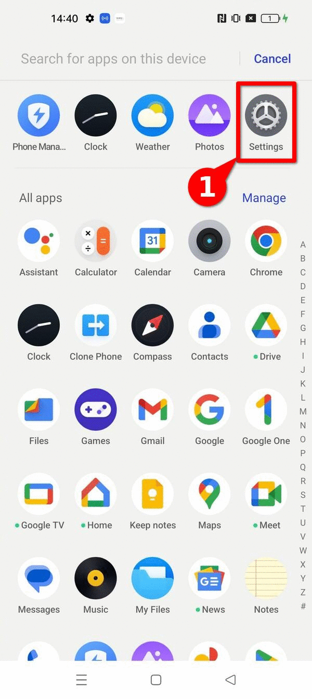
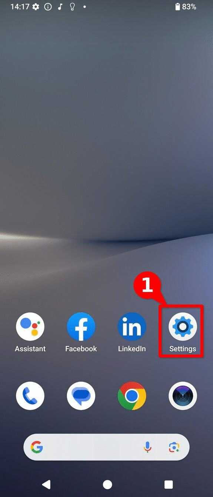
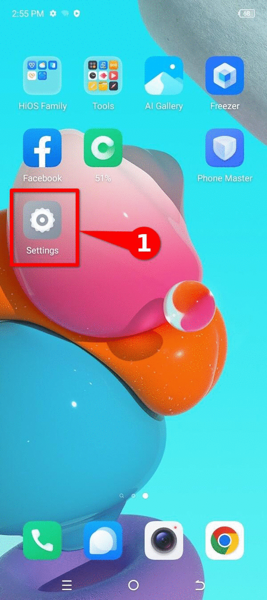

---

title: ¿Cómo extraer un reporte de errores de un dispositivo Android?
summary: Cómo extraer un reporte de errores de un dispositivo Android
keywords: triage, android, bugreport, 
lang: es
tags: [how-to, intro]
last_updated: 2025-08-18
some_url:
created: 2025-08-18
comments: true
author:
    name: Daniel
    url: https://socialtic.org/quienes-somos/
    description: SocialTIC

translation-review-pending: true
---

# Guia: Como extrair um relatório de bug de um dispositivo Android?

Este documento é **parte de um repositório de documentação técnica** que visa estabelecer uma base de conhecimento comprovada, flexível e acessível para **impulsionar a análise forense consensual em benefício da sociedade civil**. Para organizar o conteúdo, é usada a estrutura de referência de documentação técnica [Diataxis](../../references/00-glossary/index.md#diataxis).

Esse recurso específico se enquadra na categoria de **guias de instruções** e mostra as etapas necessárias para **gerar um relatório de bug ou *bugreport****,* usando o **consolo de depuração do ADB** e por meio da **interface gráfica** de um dispositivo.  Este é um material **introdutório**, complementar a outros recursos, como o explicador forense baseado em registro para dispositivos Android e o guia de habilitação do ADB; e **faz parte das etapas a serem seguidas para realizar a triagem inicial**.   

Agradecemos a **colaboração** do [Reporters Without Borders security lab] (https://rsf.org/en/digital-security-lab), que forneceu as imagens necessárias para a produção deste guia.


## O que é um relatório de bug ou *bugreport*?

Como o nome sugere, um *relatório de bugs* é uma **compilação de registros e informações de diagnóstico** que permite a **identificação e correção de bugs** durante o desenvolvimento do aplicativo. Nativamente, o sistema operacional Android permite que os relatórios de bugs sejam gerados por meio da **interface gráfica e do console ADB**.  

No contexto da análise forense consensual, o *relatório de bugs* é um artefato forense útil para **rastrear dispositivos Android, inclusive por meio da ferramenta MVT**. Por exemplo, a equipe da Amnesty Tech usou uma técnica semelhante para a detecção do spyware NoviSpy.


## O que é necessário para extrair um *bugreport*?

Abaixo estão os requisitos para extrair um relatório de bug por meio da GUI e do console ADB.

=== "GUI"

    Para extrair um relatório de bug por meio da GUI, **só é necessário o dispositivo Android** a ser analisado.

    Para gerar o relatório de bug, é necessário **ativar o modo de desenvolvedor** no dispositivo Android a ser testado. Se necessário, consulte o guia sobre *Como ativar o modo de desenvolvedor em diferentes modelos de Android*.

=== "Por meio do ADB"

    Para extrair um relatório de bug, é necessário usar o console ADB:

    * **O dispositivo Android a ser testado**: Habilite o [modo de desenvolvedor](../../references/00-glossary/index.md#developer-mode) e [habilite a depuração USB](../../references/00-glossary.md#adb). Se necessário, consulte nossos guias sobre como ativar as opções de desenvolvedor ou o guia sobre como ativar o ADB.
    * Computador Windows, Linux ou Mac:** Será usado para realizar a extração.  
    * Tenha um telefone-computador com **cabo de transferência de arquivos**.


## Etapas para gerar um _bugreport_ por meio da interface gráfica

Na maioria dos dispositivos Android, é possível gerar um relatório de bug sem fazer download de ferramentas adicionais, apenas navegando pelos menus do dispositivo.  Esse será o **método de escolha** **quando um defensor for solicitado a compartilhar esse artefato forense**.

!!! Dica "Gerar relatório de bug usando o ADB".

    Também é possível extrair um **relatório de bugs do console ADB**. Esse procedimento pode ser mais ágil e adequado para analistas que desejam extrair relatórios de bugs de vários dispositivos.

    [:octicons-arrow-right-24: Take me to the instructions](#passos-para-gerar-um-relatório-de-bugs-através-da-interface-gráfica)

Devido à forma como o sistema operacional Android é desenvolvido e às camadas de personalização adicionadas por cada fabricante, as **instruções exatas para gerar um relatório de bug variam um pouco**. Abaixo estão as instruções para diferentes fabricantes e versões do sistema operacional Android.

!!! pergunta "Por que as instruções mudam entre dispositivos diferentes?"

    O sistema operacional Android baseia seu núcleo no projeto de código aberto [*Android Open Source Project*](https://source.android.com/)*.* No entanto, [a maioria dos fabricantes usa uma versão proprietária do Google](https://www.makeuseof.com/tag/android-really-open-source-matter/), sobre a qual são adicionadas camadas de personalização adicionais, que, na maioria dos casos, também são proprietárias.

    [:octicons-arrow-right-24: Leia mais sobre isso aqui](../02-how-to-enable-developer-options/index.md#why-there-are-different-ways-to-enable-them)


### Honor Magic 5 Lite (Magic OS)

Para gerar um relatório de bug, você precisa **ter acesso às opções de desenvolvedor**. Seesse menu ainda não foi ativado, você pode seguir estas **[etapas para ativar as opções de desenvolvedor em um dispositivo Honor](../02-how-to-enable-developer-options/index.md#honor-magic-os)**.

Depois de ativar as opções de desenvolvedor, siga estas **gerar um relatório de bug**, mostradas na **imagem 1**.  

1. abra o menu **Configurações**.
2. navegue até a última opção **System**.
3. navegue até a opção **Developer Options**.
4. Selecione a opção para "**Gerar um relatório de bug**".
5. Escolha a opção "**Relatório completo "**.
6. Clique em "**Relatório "**.
7. Quando ele estiver **completo**, você verá uma notificação. Toque em **tocar para compartilhar**.
8. Uma **mensagem de alerta** sobre informações pessoais será exibida. Toque em **OK**.
9. Selecione seu mecanismo preferido e **compartilhe o relatório de bug**.


Etapas para gerar um relatório de bug em um dispositivo Honor Magic Lite executando o Magic OS 7.1 no Android 13](../../../../../assets/05-how-to/bug-report-honor-magic5-lite.gif "image 1"){: style="height:480x;width:216px"}
/// legenda
**Imagem 1**.  Etapas para gerar um relatório de bug em um dispositivo Honor Magic Lite com Magic OS 7.1 no Android 13.
///


### Motorola (Hello UI)

Para gerar um relatório de bug, você precisa **ter acesso às opções do desenvolvedor**. Se esse menu ainda não tiver sido ativado, você pode seguir estas **[etapas para ativar as opções do desenvolvedor em dispositivos Motorola](../02-how-to-enable-developer-options/index.md#motorola-hello-ui)**.

Depois de ativar as opções de desenvolvedor, siga estas **gerar um relatório de bug**, mostradas na **imagem 2**.  

1. abra o menu **Configurações**.
2. navegue até a última opção **System**.
3. navegue até a opção **Developer Options**.
4. Selecione a opção para "**Gerar um relatório de bug**".
5. Escolha a opção "**Relatório completo "**.
6. Clique em "**Relatório "**.
7. Quando ele estiver **completo**, você verá uma notificação. Toque em **tocar para compartilhar**.
8. Uma **mensagem de alerta** sobre informações pessoais será exibida. Toque em **OK**.
9. Selecione seu mecanismo preferido e **compartilhe o relatório de bug**.

{: style="height:480x;width:216px"}
/// legenda
**Imagem 2**. Etapas para gerar um relatório de bug em um dispositivo Motorola Edge Neo 40 usando o Hello UI no Android 13.
///

### Nokia

Para gerar um relatório de bug, você precisa **ter acesso às opções de desenvolvedor**. Se esse menu ainda não tiver sido ativado, você pode seguir estas **[etapas para ativar as opções do desenvolvedor em dispositivos Nokia](../02-how-to-enable-developer-options/index.md#nokia)**.

Depois de ativar as opções de desenvolvedor, siga estas **gerar um relatório de bug**, mostradas na **imagem 3**.  

1. abra o menu **SETTINGS**.
2. navegue até a última opção **System**.
3. navegue até a opção **Developer Options**.
4. Selecione a opção para "**Gerar um relatório de bug**".
5. Escolha a opção "**Relatório completo "**.
6. Clique em "**Relatório "**.
7. Quando ele estiver **completo**, você verá uma notificação. Toque em **tocar para compartilhar**.
8. Uma **mensagem de alerta** sobre informações pessoais será exibida. Toque em **OK**.
9. Selecione seu mecanismo preferido e **compartilhe o relatório de bug**.


{: style="height:480x;width:216px"}
/// legenda
**imagem 3**. Etapas para gerar um relatório de bug em um dispositivo Nokia G42 5G usando o Android 13.
///

### Oppo (Magic OS)

Para gerar um relatório de bug, você precisa **ter acesso às opções de desenvolvedor**. Se esse menu ainda não tiver sido ativado, você pode seguir estas **[etapas para ativar as opções do desenvolvedor em dispositivos Oppo](../02-how-to-enable-developer-options/index.md#oppo-reno-10-color-os)**.

Depois de ativar as opções de desenvolvedor, siga estas **gerar um relatório de bug**, mostradas na **imagem 4**.  

1. abra o menu **Configurações**.
2. navegue até a última opção **Additional Tools**.
3. navegue até a opção **Developer Options**.
4. Selecione a opção "**Error Reporting**" (Relatório de erros).
5. Escolha a opção "**Complete Report**" (Relatório completo). 6.
6. Clique em "**Report "**.
7. Quando ele estiver **completo**, você verá uma notificação. Toque em **tocar para compartilhar**.
8. Uma **mensagem de alerta** sobre informações pessoais será exibida. Toque em **OK**.
9. Selecione seu mecanismo preferido e **compartilhe o relatório de bug**.


Etapas para gerar um relatório de bug em um dispositivo OPPO Reno 10 usando o Android 13](../../../../assets/05-how-to/bug-report-oppo-reno10-5g.gif "image 5"){: style="height:480x;width:216px"}
/// legenda
**Imagem 4**. Etapas para gerar um relatório de bug em um dispositivo OPPO Reno 10 usando o Android 13
///


### Realme (Realme UI)

Para gerar um relatório de bug, você precisa **ter acesso às opções de desenvolvedor**. Se esse menu ainda não tiver sido ativado, você pode seguir estas **[etapas para ativar as opções de desenvolvedor em um dispositivo Realme](../02-how-to-enable-developer-options/index.md#realme-realme-ui)**.

Depois de ativar as opções de desenvolvedor, siga estas **gerar um relatório de bug**, mostrado na **imagem 5**.  

1. abra o menu **Configurações**.
2. navegue até a última opção **Additional Tools**.
3. navegue até a opção **Developer Options**.
4. Selecione a opção para "**Gerar um relatório de bug**".
5. Escolha a opção "**Relatório completo "**.
6. Clique em "**Relatório "**.
7. Quando ele estiver **completo**, você verá uma notificação. Toque em **tocar para compartilhar**.
8. Uma **mensagem de alerta** sobre informações pessoais será exibida. Toque em **OK**.
9. Selecione seu mecanismo preferido e **compartilhe o relatório de bug**.


{: style="height:480x;width:216px"}
/// legenda
**Imagem 5**. Etapas para gerar um relatório de bug em um dispositivo Realme GT2 Pro com RealMe UI 4.0 usando o Android 13
///

### Samsung (One UI)

Para gerar um relatório de bug, você precisa **ter acesso às opções de desenvolvedor**. Se esse menu ainda não tiver sido ativado, você pode seguir estas **[etapas para ativar as opções de desenvolvedor em um dispositivo Samsung](../02-how-to-enable-developer-options/index.md#samsung-one-ui)**.

Depois de ativar as opções do desenvolvedor, siga estas **gerar um relatório de bug**, mostradas na **imagem 6**.  

1. abra o menu **Configurações**.
2. navegue até a opção **Developer Options**.
3. selecione a opção para "**Gerar um relatório de bug**".
4. Escolha a opção "**Relatório completo "**.
5. Toque em "**Reportar "**.
6. Quando ele estiver **completo**, você verá uma notificação. Toque em **tocar para compartilhar**.
7. Uma **mensagem de alerta** sobre informações pessoais será exibida. Toque em **OK**.
8. Selecione seu mecanismo preferido e **compartilhe o relatório de bug**.

{: style="height:480x;width:216px"}
/// legenda
**Imagem 6**. Etapas para gerar um relatório de bug em um dispositivo Samsung Galaxy A54 com One UI em um dispositivo com Android 13
///

### Sony (Xperia UI)


Para gerar um relatório de bug, você precisa **ter acesso às opções de desenvolvedor**. Se esse menu ainda não tiver sido ativado, você pode seguir estas **[etapas para ativar as opções do desenvolvedor em dispositivos Sony](../02-how-to-enable-developer-options/index.md#sony-xperia-ui)**.

Depois de ativar as opções de desenvolvedor, siga estas **gerar um relatório de bug**, mostradas na **imagem 7.**.

1. abra o menu **Configurações**.
2. navegue até a última opção **Sistema** 3.
3. navegue até a opção **Developer options**.
4. Selecione a opção para "**Gerar um relatório de bug**".
5. Escolha a opção "**Relatório completo "**.
6. Clique em "**Relatório "**.
7. Quando ele estiver **completo**, você verá uma notificação. Toque em **tocar para compartilhar**.
8. Uma **mensagem de alerta** sobre informações pessoais será exibida. Toque em **OK**.
9. Selecione seu mecanismo preferido e **compartilhe o relatório de bug**.

{: style="height:480x;width:216px"}
/// legenda
**Imagem 7**. Etapas para gerar um relatório de bug em um dispositivo Sony Xperia 10V com Xperia UI 4.0 usando o Android 14.
///


### Techno (Hi OS)

Para gerar um relatório de bug, você precisa **ter acesso às opções do desenvolvedor**. Se esse menu ainda não tiver sido ativado, você pode seguir estas **[etapas para ativar as opções de desenvolvedor nos dispositivos Tecno](../02-how-to-enable-developer-options/index.md#tecno-hi-os)**.  .

Depois de ativar as opções de desenvolvedor, siga estas **gerar um relatório de bug**, mostradas na **imagem 8.**.

1. abra o menu **Configurações**.
2. navegue até a última opção **System** 3.
3. navegue até a opção **Developer options**.
4. Selecione a opção para "**Gerar um relatório de bug**".
5. Escolha a opção "**Relatório completo "**.
6. Clique em "**Reportartransporte "**.
7. Quando estiver **completo**, você verá uma notificação. Clique em **tocar para compartilhar**.
8. Uma **mensagem de alerta** sobre informações pessoais será exibida. Toque em **OK**.
9. Selecione seu mecanismo preferido e **compartilhe o relatório de bug**.

{: style="height:480x;width:216px"}
/// legenda
**Imagem 8**. Etapas para gerar um relatório de bug em um dispositivo Tecno Spark Go com Hi OS usando o Android 13.
///

### Xiaomi (Hyper OS)

Para gerar um relatório de bug, você precisa **ter acesso às opções de desenvolvedor**. Se esse menu ainda não tiver sido ativado, você pode seguir estas **passo para ativar as opções de desenvolvedor em um dispositivo Xiaomi**.

Depois de ativar as opções do desenvolvedor, siga estes **gerar um relatório de bug**, mostrados na **imagem 9.

1. abra o menu **Configurações**.
2. navegue até a última opção **About Device** 3.
3. navegue até a opção **Device Details** (Detalhes do dispositivo).
4. Localize as **Informações da CPU e toque 5 vezes** 5.
5. Você verá um alerta de notificação sobre informações pessoais. Clique em **Concordo**.
6. Quando estiver **completo**, você verá uma notificação. **Toque nela para ir para a pasta de arquivos.
7. **Localize o relatório de bug recém-gerado** e clique para compartilhar.
8. Selecione o mecanismo preferido e **compartilhe o relatório de bug**.

Etapas para gerar um relatório de bug em um dispositivo Xiaomi 13T](../../../assets/05-how-to/bug-report-xiaomi-13t.gif "image 10"){: style="height:480x;width:216px"}
/// legenda
**imagem 9**. Etapas para gerar um relatório de bug em um dispositivo Xiaomi 13T.
///


## Etapas para gerar um *relatório de bug* por meio do console ADB

Além do método para gerar um relatório de bug por meio da interface gráfica, é possível gerar um relatório de bug por meio do console ADB seguindo estas etapas. É importante lembrar que, antes de seguir essas instruções, você deve ativar a depuração USB.

### Gerar o relatório de bug

Se você tiver **apenas um dispositivo conectado**, poderá obter um relatório de erro com o adb, como segue:

```
$ adb bugreport
```


Se **você não especificar um caminho** para o relatório de bug, ele será armazenado no **diretório local**. Se quiser incluir um caminho específico, você pode adicioná-lo como um parâmetro da seguinte forma:

```
$ adb bugreport E:\Reports MyBugReportsPath

```

!!! aviso "Vários dispositivos"

    Se você tiver **múltiplos dispositivos conectados**, deverá **especificar o dispositivo com a opção. Execute o comando `adb devices` para obter o número de série do dispositivo e gerar o relatório de erro:

    ```
    $ adb devices
    Lista de dispositivos conectados
    Dispositivo emulator-5554
    Dispositivo 8XV7N15C31003476

    $ adb -s 8XV7N15C31003476 bugreport

    ```

### Extrair relatório de bug

Depois que o sinal é enviado ao dispositivo para gerar o relatório de erros, é possível **extraí-lo diretamente para o computador** de onde o ADB está sendo executado.

Primeiro, devemos **identificar o relatório de erro a ser extraído**. Você pode usar o comando `adb shell ls /bugreports/` para visualizar os relatórios armazenados, que, por padrão, estarão na pasta `/bugreports/.`.

```
$ adb shell ls /bugreports/` para ver os relatórios armazenados na pasta `/bugreports/.``.
bugreport-foo-bar.xxx.YYYYY-MM-DD-HH-MM-SS-dumpstate_log-yyy.txt
bugreport-foo-bar.xxx.YYYYY-MM-DD-HH-MM-SS.zip
dumpstate-stats.txt
```

Depois que o relatório de bug a ser extraído for identificado, ele poderá ser **copiado para o computador** por meio do seguinte comando:

```
$ adb pull /bugreports/bugreport-foo-bar.xxx.YYYYYY-MM-DD-HH-MM-SS.zip
```

Depois que esse comando for executado, o arquivo será **copiado para o diretório de onde o ADB está sendo executado**.

## Conclusão

Um **relatório de bug** refere-se a um relatório de bug gerado pelo sistema operacional Android e inclui informações úteis, especialmente para depurar bugs durante o desenvolvimento de aplicativos. No entanto, **muitos dos registros e comportamentos incluídos no *relatório de bugs** são úteis para análise forense**. A extração do relatório de bugs é uma das primeiras etapas do ciclo de investigação e é uma maneira comum de iniciar o processo de triagem em dispositivos Android.

Devido à **diversidade de fabricantes** e versões do sistema operacional Android, apresentamos neste material uma lista de fabricantes e **instruções passo a passo para gerar um relatório de bug**, para **facilitar e promover a análise forense consensual** em benefício da sociedade civil. Lembre-se de sempre discutir e obter consentimento informado antes de extrair informações forenses.

Se você **tiver acesso a uma interface gráfica que não sejae mostrado na lista**, e você deseja incorporar a captura correspondente a esse recurso, pode escrever para nós por meio de um *issue* ou, se estiver familiarizado com markdown, pode enviar uma solicitação de integração por meio de uma *pull request*.


## Comentários

Você tem **comentários ou sugestões** sobre este recurso? Você pode usar a função **comentário abaixo** para nos deixar suas ideias ou comentários. Certifique-se de seguir nosso [código de conduta] (../../community/code-of-conduct/). A função de comentário está vinculada diretamente à seção [_Discussions_ do Github] (https://github.com/Socialtic/forensics/discussions), onde você também pode **participar diretamente das discussões**, se preferir.   

